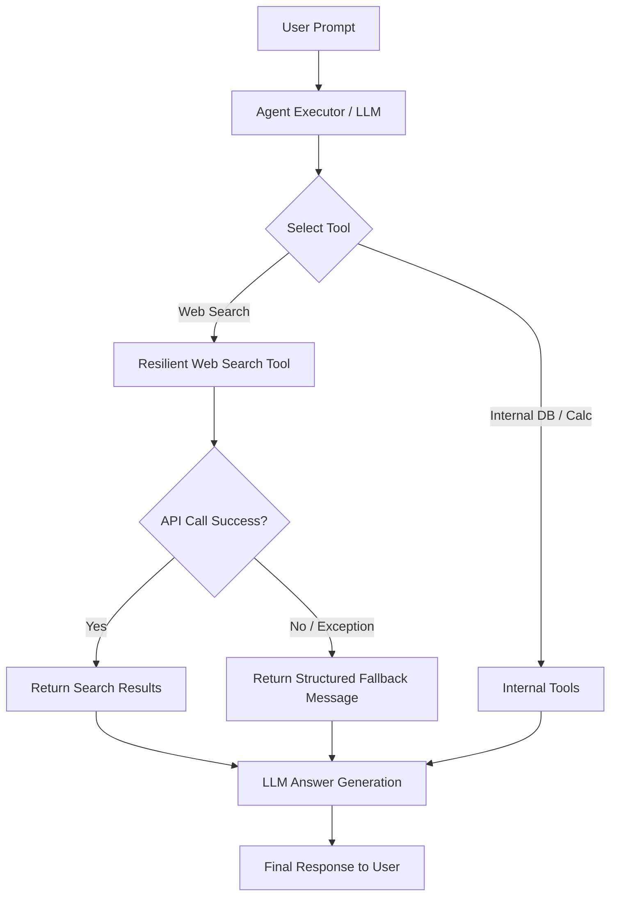

# Resilient AI Agents: Loading States, Tool Error Handling & Fallback Strategies

## Overview & Architecture

Production-grade AI agents must remain responsive and fault-tolerant during dynamic execution
loops. When external tools (such as web search APIs) experience rate limits, network timeouts, or
parsing errors, the agent loop must not crash. Instead, the system should track execution state
changes in real time and return structured fallback messages for seamless degradation.



---

## Core Concepts & Design Patterns

### 1. Callback-Driven Loading State Management
Tracking agent state transitions (`THINKING`, `LOADING`, `COMPLETED`, `ERROR`, `FINISHED`) requires
decoupling status monitoring from core business logic. In LangChain, this is achieved by inheriting
from `BaseCallbackHandler`.

Key callback lifecycle methods:
- `on_chain_start()`: Triggered when agent reasoning begins.
- `on_tool_start()`: Triggered when a tool starts execution (indicates active loading).
- `on_tool_end()`: Triggered when tool execution succeeds.
- `on_tool_error()`: Triggered when a tool throws an unhandled exception.
- `on_chain_end()`: Triggered when the agent loop completes.

### 2. Resilient Tool Exception Wrapper
Wrapping external API calls (e.g. DuckDuckGo Search) inside a try-except block prevents exceptions
from propagating up to `AgentExecutor`. Instead of raising an unhandled exception:
1. Catch network, timeout, or rate-limit errors (`Exception`).
2. Format a clear fallback string detailing the query and failure reason.
3. Allow the LLM to synthesize an answer gracefully using base pre-training knowledge.

### 3. Execution Loop Resilience Parameters
`AgentExecutor` provides flags to handle unexpected LLM outputs and execution anomalies:
- `handle_parsing_errors=True`: Instructs the agent executor to feed invalid output formats back to
  the LLM with correction prompts instead of aborting.
- `handle_tool_error=True`: Catches tool-level exceptions and provides standard error strings back
  to the agent scratchpad.

---

## Technical Implementation

Below is the implementation pattern for a resilient agent with loading callbacks and web search
fallback:

```python
from typing import Any
from langchain_classic.agents import AgentExecutor, create_tool_calling_agent
from langchain_community.tools import DuckDuckGoSearchRun
from langchain_core.callbacks import BaseCallbackHandler
from langchain_core.prompts import ChatPromptTemplate, MessagesPlaceholder
from langchain_core.tools import tool


class AgentLoadingStatusHandler(BaseCallbackHandler):
    """Tracks agent loading states and records execution event logs."""

    def __init__(self) -> None:
        self.current_state: str = "IDLE"
        self.logs: list[str] = []

    def _set_state(self, state: str, message: str = "") -> None:
        self.current_state = state
        self.logs.append(f"[{state}] {message}".strip())

    def on_chain_start(
        self, serialized: dict[str, Any], inputs: dict[str, Any], **kwargs: Any
    ) -> None:
        self._set_state("THINKING", "Agent reasoning process initialized")

    def on_tool_start(
        self, serialized: dict[str, Any], input_str: str, **kwargs: Any
    ) -> None:
        tool_name = serialized.get("name", "unknown_tool")
        self._set_state(
            "LOADING", f"Executing tool '{tool_name}' with input: {input_str}"
        )

    def on_tool_end(self, output: str, **kwargs: Any) -> None:
        self._set_state("COMPLETED", "Tool execution completed")

    def on_tool_error(self, error: BaseException, **kwargs: Any) -> None:
        self._set_state("ERROR", f"Tool failed: {error}")

    def on_chain_end(self, outputs: dict[str, Any], **kwargs: Any) -> None:
        self._set_state("FINISHED", "Agent loop complete")


@tool
def web_search(query: str) -> str:
    """Search the web using DuckDuckGo with graceful exception handling."""
    try:
        ddg = DuckDuckGoSearchRun()
        return ddg.run(query)
    except Exception as err:
        return (
            f"[Fallback] Web search service unavailable for '{query}'. "
            f"Reason: {err}. Please proceed using internal knowledge."
        )


def build_resilient_agent(model: Any, tools: list[Any]) -> AgentExecutor:
    prompt = ChatPromptTemplate.from_messages(
        [
            (
                "system",
                "You are an intelligent assistant. Use web search when needed. "
                "If web search returns a fallback message, answer gracefully.",
            ),
            ("human", "{input}"),
            MessagesPlaceholder(variable_name="agent_scratchpad"),
        ]
    )
    agent = create_tool_calling_agent(model, tools, prompt)
    return AgentExecutor(agent=agent, tools=tools, handle_parsing_errors=True)
```

---

## Best Practices & Common Pitfalls

1. **Avoid Swallowing Errors Blindly**: Return informative fallback strings so the LLM knows
   search failed, rather than returning empty strings which lead to hallucinated search results.
2. **Rate Limit Throttling**: Use retry loops with exponential backoff before triggering fallback.
3. **UI Loading Feedback**: Stream callback state events to front-end clients via WebSockets or SSE
   to provide clear loading spinners during tool execution.
4. **Sanitize Error Strings**: Strip API keys or internal stack traces from error messages before
   passing them to the LLM prompt.

---

## Interview Questions & Answers (5 YOE Level)

### 1. Conceptual / Theoretical
**Q: How does graceful error handling inside custom agent tools differ from using `handle_tool_error` in AgentExecutor?**
- **A**: Catching exceptions inside a `@tool` implementation gives granular control over the error
  contract. It enables custom retry logic, circuit breaking, and domain-specific fallback strings
  (e.g., instructing the LLM to rely on pre-training knowledge). `handle_tool_error` in
  `AgentExecutor` is a high-level safety net that catches uncaught exceptions across any tool and
  injects a generic string into the agent scratchpad.

*Interviewer Follow-up*: Why shouldn't a tool raise `sys.exit` or return an empty string when external search fails?
- **Response**: Raising `sys.exit` crashes the entire worker process. Returning an empty string
  confuses the LLM into believing no web results exist for a query, whereas an explicit fallback
  string informs the LLM that the search provider failed, allowing it to frame its answer with appropriate disclaimers.

---

### 2. Practical / Scenario-Based
**Q: Your production AI agent uses DuckDuckGo for live news queries, but faces HTTP 429 rate limit spikes during peak hours. How do you handle this?**
- **A**:
  1. **Primary Circuit Breaker**: Wrap the search API with a circuit breaker (e.g. `pybreaker` or
     `tenacity` retry with backoff).
  2. **Fallback Search Provider**: If DuckDuckGo returns HTTP 429, failover to a secondary search
     provider (such as Tavily or Serper API).
  3. **Graceful Degradation Message**: If all external search options fail, return a structured
     fallback notice: `"[Fallback] Search service temporarily busy. Answering using stored knowledge."`
  4. **Client Notification**: Emitting a loading/status event to inform the user that live search
     failed and fallback knowledge is being utilized.

*Interviewer Follow-up*: How do you test this scenario in CI/CD without hitting live API limits?
- **Response**: Mock `DuckDuckGoSearchRun.run` in pytest using `patch.object` with
  `side_effect=Exception("HTTP 429 Rate Limit Exceeded")` and verify that the tool returns the
  expected fallback text and does not throw an unhandled exception.

---

### 3. Coding / Implementation
**Q: Write a custom LangChain CallbackHandler that measures execution time and emits loading states for long-running tools.**
- **A**:
```python
import time
from typing import Any
from langchain_core.callbacks import BaseCallbackHandler


class PerformanceLoadingHandler(BaseCallbackHandler):
    def __init__(self) -> None:
        self.start_times: dict[str, float] = {}
        self.execution_stats: list[dict[str, Any]] = []

    def on_tool_start(
        self, serialized: dict[str, Any], input_str: str, **kwargs: Any
    ) -> None:
        tool_name = serialized.get("name", "unknown")
        self.start_times[tool_name] = time.perf_counter()
        print(f"[LOADING] Executing tool '{tool_name}'...")

    def on_tool_end(self, output: str, **kwargs: Any) -> None:
        tool_name = kwargs.get("name", "tool")
        start = self.start_times.pop(tool_name, time.perf_counter())
        duration = time.perf_counter() - start
        self.execution_stats.append({"tool": tool_name, "duration_sec": duration})
        print(f"[COMPLETED] Tool '{tool_name}' finished in {duration:.2f}s")
```

*Interviewer Follow-up*: How do you handle thread safety if multiple user queries execute concurrently?
- **Response**: Use thread-local storage or instantiate a fresh `PerformanceLoadingHandler` object
  per invocation context.

---

### 4. System Design / Architecture
**Q: Design a real-time agent web UI architecture that displays progress spinners (Loading, Searching, Generating) and handles tool outages.**
- **A**:
1. **Frontend**: Next.js client connected to backend via Server-Sent Events (SSE) or WebSockets.
2. **Backend Engine**: FastAPI serving LangChain `AgentExecutor` with a custom `BaseCallbackHandler`.
3. **Event Streaming**: The callback handler streams JSON events (`{ "type": "status", "state": "SEARCHING_WEB" }`) over SSE.
4. **Resilient Tools**: External API calls are guarded by timeout parameters and try-except fallbacks.
5. **Fallback Flow**: When search fails, callback handler pushes `{ "type": "warning", "message": "Search unavailable, using internal knowledge" }` to UI, keeping the progress bar green while displaying degraded results.

---

## References
- [LangChain Callbacks Documentation](https://python.langchain.com/docs/concepts/callbacks/)
- [LangChain Custom Tool Exception Handling](https://python.langchain.com/docs/how_to/tools_error_handling/)
- [DuckDuckGo Search Integration Guide](https://python.langchain.com/docs/integrations/tools/duckduckgo_search/)
