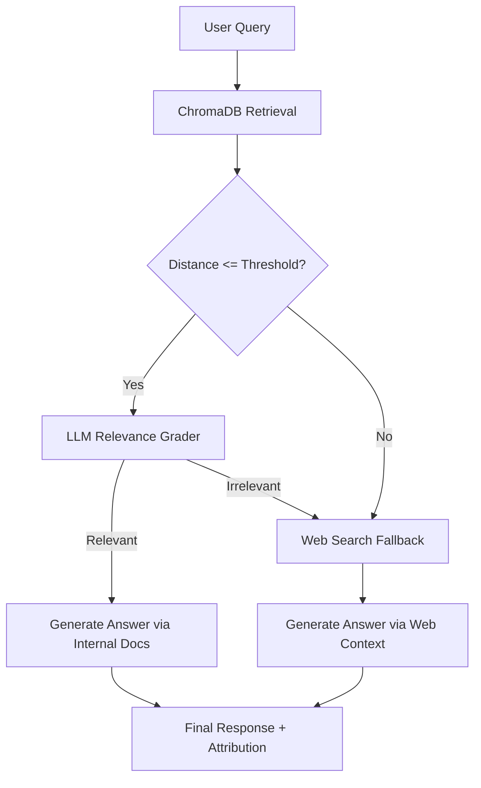

# Agentic RAG: ChromaDB Vector Search with Web Search Fallback

## Overview & Architecture

An **Agentic RAG System with Fallback** combines internal knowledge retrieval with
external web search. The primary objective is to maintain high answer fidelity by querying
an internal vector database (ChromaDB) first. If internal retrieval yields insufficient or
low-confidence data, the agent dynamically routes the query to a web search fallback.



---

## Core Concepts & Fallback Mechanisms

### 1. Adaptive Routing & Dynamic Fallback
Traditional RAG pipelines unconditionally feed retrieved context into an LLM, leading to
potential hallucinations if the vector database lacks relevant context. Agentic RAG
introduces conditional edge routing based on confidence metrics and LLM evaluation.

### 2. ChromaDB Distance Metrics & Thresholding
ChromaDB supports three space distance metrics (`hnsw:space`):
- **L2 (Squared Euclidean)**: Range $[0, \infty)$. Lower value indicates higher similarity.
- **Cosine**: Distance $= 1 - \text{Cosine Similarity}$. Range $[0, 2]$.
- **Inner Product (IP)**: Distance $= 1 - \langle A, B \rangle$.

To trigger fallback accurately, the retriever evaluates whether the top distance $d_{\text{top}}$
exceeds a pre-calibrated threshold $d_{\text{max}}$.

---

## Technical Implementation

Below is a complete Python implementation using standard design patterns for an Agentic RAG
agent.

```python
from typing import Any, Dict, List, Literal, Optional, TypedDict
import chromadb
from pydantic import BaseModel, Field


class Document(BaseModel):
    content: str
    metadata: Dict[str, Any] = Field(default_factory=dict)
    score: Optional[float] = None


class AgentState(TypedDict):
    query: str
    documents: List[Document]
    fallback_needed: bool
    source_used: str
    final_answer: str


class ChromaFallbackRAG:
    def __init__(
        self,
        collection_name: str = "kb_notes",
        distance_threshold: float = 0.45,
    ) -> None:
        self.client = chromadb.Client()
        self.collection = self.client.get_or_create_collection(
            name=collection_name,
            metadata={"hnsw:space": "cosine"},
        )
        self.distance_threshold = distance_threshold

    def retrieve_internal(self, query: str, top_k: int = 3) -> List[Document]:
        """Query ChromaDB and filter results by distance threshold."""
        results = self.collection.query(
            query_texts=[query],
            n_results=top_k,
        )

        docs: List[Document] = []
        if not results["documents"] or not results["documents"][0]:
            return docs

        distances = results["distances"][0] if results["distances"] else []
        contents = results["documents"][0]
        metadatas = (
            results["metadatas"][0] if results["metadatas"] else [{}] * len(contents)
        )

        for content, dist, meta in zip(contents, distances, metadatas):
            if dist <= self.distance_threshold:
                meta_dict = meta if meta is not None else {}
                docs.append(
                    Document(content=content, metadata=meta_dict, score=dist)
                )

        return docs

    def execute_web_search(self, query: str) -> List[Document]:
        """Mock web search fallback node (e.g., Tavily, Serper, DuckDuckGo)."""
        web_content = f"Web search results for query: {query}"
        return [
            Document(
                content=web_content,
                metadata={"source": "web_search", "url": "https://search.api/results"},
            )
        ]

    def grade_relevance(self, query: str, docs: List[Document]) -> bool:
        """Simulate LLM relevance grader node."""
        if not docs:
            return False
        return any(word in docs[0].content.lower() for word in query.lower().split())

    def run(self, query: str) -> AgentState:
        """Execute the agentic RAG graph flow."""
        state: AgentState = {
            "query": query,
            "documents": [],
            "fallback_needed": False,
            "source_used": "none",
            "final_answer": "",
        }

        # Step 1: ChromaDB Retrieval
        internal_docs = self.retrieve_internal(query)

        # Step 2: Relevance Check & Threshold Evaluation
        if internal_docs and self.grade_relevance(query, internal_docs):
            state["documents"] = internal_docs
            state["source_used"] = "chromadb"
        else:
            state["fallback_needed"] = True

        # Step 3: Web Search Fallback Execution
        if state["fallback_needed"]:
            web_docs = self.execute_web_search(query)
            state["documents"] = web_docs
            state["source_used"] = "web_search"

        # Step 4: Answer Generation
        context = "\n".join([d.content for d in state["documents"]])
        state["final_answer"] = (
            f"Answer based on [{state['source_used']}]: "
            f"Context summary -> {context[:100]}"
        )

        return state
```

---

## Best Practices & Common Pitfalls

1. **Embedding Model Alignment**: Ensure embedding model at ingestion matches query time.
2. **Threshold Calibration**: Test distance distributions on domain queries.
3. **Data Privacy**: Sanitize internal queries before triggering external web search APIs.
4. **Latency Budget**: Asynchronous execution or parallel retrieval prevents latency spikes.

---

## Interview Questions & Answers (5 YOE Level)

### 1. Conceptual / Theoretical
**Q: How does an Agentic RAG fallback architecture differ from standard naive RAG?**
- **A**: Naive RAG is a static pipeline (Retrieve $\rightarrow$ Augment $\rightarrow$ Generate)
  regardless of retrieved context quality. Agentic RAG introduces dynamic decision-making
  loops where an agent evaluates context relevance and score thresholds, branching to
  external web search tools or query rewriting when internal retrieval fails.

*Interviewer Follow-up*: What metric would you track to evaluate if threshold is optimal?
- **Response**: Track the ratio of fallback triggers alongside answer precision/hallucination
  rate. High fallback rates on domain queries indicate an overly aggressive threshold or
  poor index coverage.

---

### 2. Practical / Scenario-Based
**Q: Cosine distance is 0.65 in ChromaDB for a query. How to decide on triggering web search?**
- **A**: Cosine distance $= 1 - \text{cosine\_similarity}$. A distance of 0.65 translates
  to a similarity score of 0.35, which signifies low semantic overlap. I would configure
  the distance threshold at $\le 0.40$ (similarity $\ge 0.60$) for internal domain retrieval,
  causing a distance of 0.65 to automatically flag `fallback_needed = True` and route
  to web search.

*Interviewer Follow-up*: What if the query contains PII or confidential company metrics?
- **Response**: Implement an anonymization/scrubbing layer before forwarding queries to
  external web search tools, or drop confidential query parameters entirely.

---

### 3. Coding / Implementation
**Q: Write a function to check if ChromaDB results meet a minimum quality threshold.**
- **A**:
```python
def validate_retrieval(
    results: dict,
    max_distance: float = 0.40
) -> tuple[bool, list]:
    if not results or not results.get("documents") or not results["documents"][0]:
        return False, []

    valid_docs = []
    distances = results.get("distances", [[]])[0]
    documents = results["documents"][0]

    for doc, dist in zip(documents, distances):
        if dist <= max_distance:
            valid_docs.append(doc)

    has_valid_context = len(valid_docs) > 0
    return has_valid_context, valid_docs
```

*Interviewer Follow-up*: How do you test this function in `pytest`?
- **Response**: Mock the ChromaDB `query` response dictionary with both valid distances
  ($< 0.40$) and invalid distances ($> 0.40$) to test threshold logic and empty edge cases.

---

### 4. System Design / Architecture
**Q: Design a fault-tolerant Agentic RAG system (10k RPM) with web search fallback.**
- **A**:
1. **Caching Layer**: Redis cache keying `(hash(query), embedding_model_version)` for fast
   response on repeated queries.
2. **Vector DB Cluster**: Distributed ChromaDB or Milvus with HNSW indexing and read-replicas.
3. **Async Agent Engine**: FastGraph / LangGraph orchestration running on FastAPI workers
   using async HTTP calls (`httpx`) to Web Search APIs.
4. **Fallback Queue & Rate Limiter**: Circuit breaker for external search APIs to prevent rate
   limit exhaustion and control API cost spikes.
5. **Observability**: OpenTelemetry tracing each node step (Retrieve, Grade, Search, Generate).

---

## References
- [LangChain RAG Fallback Documentation](https://python.langchain.com/docs/tutorials/rag/)
- [ChromaDB Distance Metrics Guide](https://docs.trychroma.com/usage-guide)
- [LangGraph Agentic Search Routing](https://langchain-ai.github.io/langgraph/)
