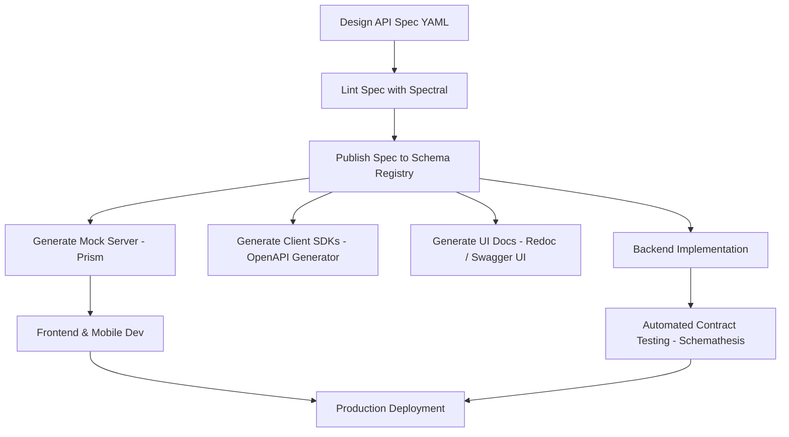

# API Documentation Schema

## 1. Structured Notes

### Overview & Definition
An **API Documentation Schema** is a formal, machine-readable specification that describes the structure, contract, and behavior of an API. It defines endpoints, HTTP methods, request parameters, request/response payload schemas, data types, authentication mechanisms, status codes, and example payloads.

Unlike human-only static documentation (such as plain Markdown or Wiki pages), a schema serves as a dynamic **single source of truth** (SSOT) that drives both human-readable UI documentation and automated software tooling.

---

### Key Schema Standards & Formats

| Standard | Primary Use Case | Key Characteristics |
| :--- | :--- | :--- |
| **OpenAPI (OAS 3.0 / 3.1)** | RESTful Web APIs | De facto standard for REST; JSON/YAML format; standardizes paths, parameters, schemas, and responses. |
| **JSON Schema** | Data Payload Validation | Standardized JSON structure definition; used inside OpenAPI and independently for document validation. |
| **GraphQL Schema (SDL)** | GraphQL APIs | Strongly typed Schema Definition Language defining Queries, Mutations, Subscriptions, and Types. |
| **AsyncAPI** | Event-Driven / WebSockets | Modeled after OpenAPI; defines event channels, messages, protocols (Kafka, WebSockets, AMQP). |

---

### Core Concepts & OpenAPI 3.1 Architecture

OpenAPI Specification 3.1 is aligned with **JSON Schema (Draft 2020-12)**. Modern API schemas consist of standard top-level objects:

1. **`openapi`**: Semantic version of the OpenAPI Specification (e.g., `3.1.0`).
2. **`info`**: Metadata including API title, description, terms of service, contact, and version.
3. **`servers`**: Array of base server URLs (e.g., production, staging, local).
4. **`paths`**: Map of API endpoints and their supported HTTP operations (`get`, `post`, `put`, `delete`).
5. **`components`**: Reusable schemas, parameters, security schemes, headers, and request bodies.
6. **`webhooks`**: Out-of-band event definitions for asynchronous notifications.
7. **`security`**: Global security requirements (OAuth 2.0, Bearer Tokens, API Keys).

#### Key Differences: OpenAPI 3.0 vs 3.1
- **JSON Schema Compatibility**: OAS 3.1 uses full JSON Schema Draft 2020-12 instead of an extended subset.
- **Nullability**: OAS 3.0 used `nullable: true`. OAS 3.1 uses native JSON Schema type arrays (e.g., `type: ["string", "null"]`).
- **Webhooks**: Top-level `webhooks` key added in OAS 3.1 for first-class async callback docs.

---

### Design Paradigms: Contract-First vs. Code-First

#### Contract-First (Schema-First)
- **Workflow**: OpenAPI spec (YAML/JSON) is designed and reviewed before writing application code.
- **Advantages**: Frontend and backend teams work in parallel using mock servers; forces thorough upfront design; avoids tech debt.
- **Tools**: Stoplight, Swagger Editor, Prism (mocking), Spectral (linting), Schemathesis (contract testing).

#### Code-First
- **Workflow**: Developers write implementation code (e.g., FastAPI models, Django REST Framework serializers) and generate the OpenAPI schema automatically.
- **Advantages**: Faster initial velocity for small teams; guarantees code and schema never drift.
- **Tools**: FastAPI (Pydantic), DRF Spectacular, Springdoc OpenAPI, NestJS Swagger module.

---

### Contract-First Lifecycle & Tooling Flow



---

### Code Examples

#### 1. OpenAPI 3.1 Specification Example (`openapi.yaml`)
```yaml
openapi: 3.1.0
info:
  title: Recipe Management API
  version: 1.0.0
  description: Production RESTful API for recipe management.
paths:
  /api/v1/recipes/:
    get:
      summary: List recipes
      operationId: listRecipes
      parameters:
        - name: page
          in: query
          required: false
          schema:
            type: integer
            default: 1
      responses:
        '200':
          description: Successful response
          content:
            application/json:
              schema:
                type: array
                items:
                  $ref: '#/components/schemas/Recipe'
    post:
      summary: Create a new recipe
      operationId: createRecipe
      requestBody:
        required: true
        content:
          application/json:
            schema:
              $ref: '#/components/schemas/RecipeCreate'
      responses:
        '201':
          description: Recipe created successfully
          content:
            application/json:
              schema:
                $ref: '#/components/schemas/Recipe'
        '400':
          $ref: '#/components/responses/400BadRequest'

components:
  schemas:
    Recipe:
      type: object
      required:
        - id
        - title
        - cooking_time_minutes
      properties:
        id:
          type: integer
          readOnly: true
        title:
          type: string
          minLength: 1
          maxLength: 255
        description:
          type: ["string", "null"]
        cooking_time_minutes:
          type: integer
          minimum: 1
    RecipeCreate:
      type: object
      required:
        - title
        - cooking_time_minutes
      properties:
        title:
          type: string
          minLength: 1
          maxLength: 255
        description:
          type: ["string", "null"]
        cooking_time_minutes:
          type: integer
          minimum: 1

  responses:
    400BadRequest:
      description: Invalid request payload
      content:
        application/json:
          schema:
            type: object
            required:
              - code
              - message
            properties:
              code:
                type: string
                example: INVALID_INPUT
              message:
                type: string
                example: Field 'title' is required.
```

#### 2. Code-First Schema Generation in FastAPI (Python)
```python
from typing import Optional
from fastapi import FastAPI, HTTPException, status
from pydantic import BaseModel, Field

app = FastAPI(
    title="Recipe API",
    version="1.0.0",
    description="Automated OpenAPI 3.1 generation via Pydantic v2",
)


class RecipeCreate(BaseModel):
    title: str = Field(..., min_length=1, max_length=255)
    description: Optional[str] = None
    cooking_time_minutes: int = Field(..., gt=0)


class RecipeResponse(RecipeCreate):
    id: int


@app.post(
    "/api/v1/recipes/",
    response_model=RecipeResponse,
    status_code=status.HTTP_201_CREATED,
    summary="Create recipe",
)
def create_recipe(payload: RecipeCreate) -> RecipeResponse:
    return RecipeResponse(id=1, **payload.model_dump())
```

---

### Best Practices & Common Pitfalls

#### Best Practices
1. **Reuse Schemas with `$ref`**: Define shared payloads (errors, pagination, timestamps) in `#/components/schemas/` to keep specs DRY.
2. **Automate Governance in CI/CD**: Run linter rules (e.g., Spectral) in continuous integration to enforce naming conventions and required description fields.
3. **Include Realistic Examples**: Add `example` or `examples` to schemas so mock servers and documentation UIs generate realistic data.
4. **Detect Breaking Changes Automatically**: Use tools like `openapi-diff` or `oasdiff` in CI pipelines to catch unintended breaking payload changes.
5. **Security Scheme Enforcement**: Explicitly reference `security` requirements at root or operation level rather than relying on ambient documentation.

#### Common Pitfalls
1. **Drift Between Code and Schema**: In contract-first development without automated contract tests (e.g. Schemathesis), code implementation often diverges from the spec.
2. **Using Deprecated OAS 3.0 Keywords in OAS 3.1**: Mixing `nullable: true` (OAS 3.0) with OAS 3.1 parser rules causes validation errors.
3. **Overly Loose Types**: Using generic `type: object` or omitting `required` fields renders schema validation useless for client callers.
4. **Exposing Internal Database Schemas**: Directly exposing ORM entities in API documentation schemas risks leaking internal fields or breaking API encapsulation.

---

### Authoritative References
- [OpenAPI Specification (OAS v3.1.0)](https://spec.openapis.org/oas/v3.1.0)
- [JSON Schema Specification (Draft 2020-12)](https://json-schema.org/draft/2020-12/json-schema-core.html)
- [AsyncAPI Specification v3.0](https://www.asyncapi.com/docs/concepts/asyncapi-document)
- [Spectral Linter by Stoplight](https://stoplight.io/open-source/spectral)
- [Schemathesis Contract Testing](https://schemathesis.readthedocs.io/)

---

## 2. Interview Questions & Answers (5 YOE Level)

### Question 1 (Conceptual): OpenAPI 3.0 vs. OpenAPI 3.1
**Q:** What are the key architectural differences between OpenAPI 3.0 and OpenAPI 3.1, and why was the alignment with JSON Schema Draft 2020-12 significant for enterprise API development?

**A:**
OpenAPI 3.0 used an extended subset of JSON Schema (Draft 4/5), creating incompatibilities where valid JSON Schemas failed in OpenAPI definitions and vice versa. For example, OAS 3.0 introduced its own `nullable: true` modifier instead of supporting JSON Schema type arrays.

Key differences in OpenAPI 3.1 include:
1. **Full JSON Schema Alignment**: OAS 3.1 adopts JSON Schema Draft 2020-12 directly. Schemas can now use `type: ["string", "null"]`, `oneOf`, `anyOf`, `allOf`, and standard JSON Schema keywords without custom vendor extensions.
2. **Top-Level Webhooks**: OAS 3.1 introduced a native `webhooks` map at the root level, allowing APIs to document out-of-band HTTP POST callbacks natively alongside incoming `paths`.
3. **Reusable Component Licenses & Summaries**: Improved metadata flexibility for API cataloging.

**Why it matters for enterprise development**:
It eliminates duplicate schema definitions. Teams can reuse the exact same JSON Schema files across API gateways, backend validators (e.g., Ajv, Pydantic), message queues, and API documentation tools without manual conversion layers.

*Follow-up Question*: How do you migrate an existing OpenAPI 3.0 specification containing `nullable: true` to OpenAPI 3.1 without breaking schema parsers?

---

### Question 2 (Scenario / System Design): Contract-First Workflow & Microservices
**Q:** You are leading a backend team building a platform of 15 microservices. Frontend, mobile, and backend teams often get blocked waiting for API implementations. How would you design a Contract-First API documentation and mocking pipeline to unblock teams and guarantee zero contract drift?

**A:**
I would establish a centralized **API-First Developer Platform**:

1. **Central Schema Repository**: Store OpenAPI 3.1 specs in a dedicated Git repository (or schema registry).
2. **CI/CD Quality Gates**:
   - **Linting**: Run `Spectral` on git push to enforce naming conventions, required response structures, and security definitions.
   - **Breaking Change Guard**: Run `oasdiff` against `main` to reject non-backward-compatible changes without version bumps.
3. **Automated Artifact Generation**:
   - **Mocking**: Automatically deploy mock servers using `Prism` for every feature branch PR. Frontend/mobile developers consume live mock endpoints immediately.
   - **SDK Generation**: Run `OpenAPI Generator` to publish typed TypeScript, Swift, and Kotlin SDK packages to private artifact feeds (npm, Swift Package Manager).
   - **Docs**: Automatically deploy Redoc / Swagger UI documentation sites per environment.
4. **Contract Verification**:
   - In the backend CI pipeline, execute `Schemathesis` property-based tests against the running service implementation to ensure response codes and payloads strictly conform to the spec before deployment.

*Follow-up Question*: What strategy would you use when an emergency hotfix requires adding an urgent response field before the spec PR is reviewed?

---

### Question 3 (Coding / Implementation): Polymorphic Payloads with Discriminators
**Q:** In OpenAPI 3.1, how do you define polymorphic request payloads (e.g., a payment endpoint accepting either `CreditCardPayment` or `PayPalPayment`), and how does the `discriminator` keyword assist client code generators? Show YAML or Pydantic code.

**A:**
Polymorphic payloads use `oneOf` (or `anyOf`) combined with a `discriminator` property. The `discriminator` explicitly tells parsers and client code generators which explicit subtype to instantiate based on a payload field value (e.g., `payment_type`).

**OpenAPI 3.1 YAML Example**:
```yaml
components:
  schemas:
    PaymentRequest:
      type: object
      required:
        - payment_type
        - amount
      properties:
        payment_type:
          type: string
        amount:
          type: number
      discriminator:
        propertyName: payment_type
        mapping:
          credit_card: '#/components/schemas/CreditCardPayment'
          paypal: '#/components/schemas/PayPalPayment'
      oneOf:
        - $ref: '#/components/schemas/CreditCardPayment'
        - $ref: '#/components/schemas/PayPalPayment'

    CreditCardPayment:
      type: object
      required:
        - card_number
        - cvc
      properties:
        card_number:
          type: string
        cvc:
          type: string

    PayPalPayment:
      type: object
      required:
        - paypal_email
      properties:
        paypal_email:
          type: string
```

**Pydantic v2 Code Example**:
```python
from typing import Annotated, Literal, Union
from pydantic import BaseModel, Field


class CreditCardPayment(BaseModel):
    payment_type: Literal["credit_card"]
    card_number: str
    cvc: str


class PayPalPayment(BaseModel):
    payment_type: Literal["paypal"]
    paypal_email: str


PaymentPayload = Annotated[
    Union[CreditCardPayment, PayPalPayment],
    Field(discriminator="payment_type"),
]
```

*Follow-up Question*: What is the difference between `oneOf` and `anyOf` in JSON Schema validation, and why is `oneOf` preferred for polymorphic unions?

---

### Question 4 (Practical / Security): Security Schemes & API Gateway Enforcement
**Q:** How do you document OAuth2 scopes and JWT Bearer authentication in an OpenAPI 3.1 schema, and how can API Gateways (like Kong or AWS API Gateway) use this schema for automated authorization enforcement?

**A:**
Security mechanisms are defined under `components.securitySchemes` and applied globally via `security` or overridden at individual operations.

**YAML Example**:
```yaml
components:
  securitySchemes:
    BearerAuth:
      type: http
      scheme: bearer
      bearerFormat: JWT
    OAuth2:
      type: oauth2
      flows:
        authorizationCode:
          authorizationUrl: https://auth.example.com/oauth/authorize
          tokenUrl: https://auth.example.com/oauth/token
          scopes:
            read:recipes: Read access to recipes
            write:recipes: Write access to recipes

security:
  - BearerAuth: []

paths:
  /api/v1/recipes/:
    post:
      summary: Create recipe
      security:
        - OAuth2:
            - write:recipes
```

**API Gateway Integration**:
Enterprise gateways (Kong, AWS API Gateway, Apigee) import OpenAPI specs directly:
- AWS API Gateway maps `securitySchemes` to Cognito/Lambda Authorizers and automatically validates required OAuth scopes per route before invoking the backend lambda/container.
- Gateways also enforce request body payload validation directly at the edge based on `components.schemas`, rejecting malformed requests (400 Bad Request) before traffic touches microservice instances.

*Follow-up Question*: How do you handle endpoints that support optional authentication (public view vs enriched authenticated view) in OpenAPI security definitions?
