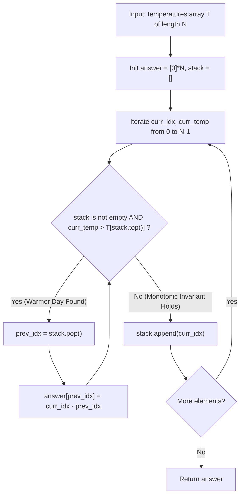

# Daily Temperatures (LeetCode 739)

Comprehensive study notes and 5 YOE senior engineering interview preparation guide on the **Monotonic Stack Pattern** for **Daily Temperatures** (LeetCode 739).

---

## 1. Core Concepts & Algorithmic Foundation

### 1.1 Problem Definition
Given an array of integers `temperatures` representing daily temperatures, return an array `answer` such that `answer[i]` is the number of days you have to wait after the $i$-th day to get a warmer temperature. If there is no future day for which this is possible, keep `answer[i] == 0`.

$$\text{For index } i, \text{ find } \min \{ j - i \mid j > i \text{ and } \text{temperatures}[j] > \text{temperatures}[i] \}$$

- **Constraints**:
  - $1 \le N \le 10^5$
  - $30 \le \text{temperatures}[i] \le 100$
  - Optimal Time Target: $\mathcal{O}(N)$
  - Optimal Auxiliary Space Target: $\mathcal{O}(N)$ (or $\mathcal{O}(1)$ beyond output array)

---

### 1.2 Algorithmic Mechanics

1. **Monotonic Decreasing Stack Invariant**:
   - A monotonic stack maintains elements in strictly decreasing (or non-increasing) order of temperature.
   - We store the **indices** of unresolved days in the stack rather than just temperature values. Storing indices allows direct calculation of distance `curr_idx - prev_idx`.
2. **Resolution Condition**:
   - When encountering a new temperature `curr_temp` at index `curr_idx`:
     - Any previous day in the stack with a temperature strictly less than `curr_temp` has found its immediate next warmer day.
     - We repeatedly pop `prev_idx = stack.pop()` and record `answer[prev_idx] = curr_idx - prev_idx`.
   - Once all colder unresolved days are popped, push `curr_idx` onto the stack.
3. **Amortized $\mathcal{O}(1)$ Per Element**:
   - Although a single iteration may pop multiple elements, each index enters the stack exactly once and is popped at most once across the entire traversal.
   - Aggregate stack operations across $N$ elements are $\le 2N$, proving rigorous $\mathcal{O}(N)$ runtime.
4. **Reverse Iteration with DP Jump Pointer**:
   - By iterating backwards ($i = N-1$ down to 0), if day $j = i + 1$ is colder ($T[j] \le T[i]$), we can jump immediately to $j + \text{answer}[j]$ without inspecting individual colder days in between.

---

## 2. Algorithm Approaches & Complexity Analysis

### 2.1 Complexity Matrix

| Approach | Time Complexity | Auxiliary Space | Remarks |
| :--- | :--- | :--- | :--- |
| **Brute Force (Nested Loop)** | $\mathcal{O}(N^2)$ | $\mathcal{O}(1)$ | TLE on $N = 10^5$; scans rightwards from each index |
| **Monotonic Decreasing Stack** | $\mathcal{O}(N)$ | $\mathcal{O}(N)$ | Industry standard canonical Next Greater Element pattern |
| **Reverse DP Jump Pointer** | $\mathcal{O}(N)$ amortized | $\mathcal{O}(1)$ aux | Mutates/reads output array directly; eliminates stack heap allocations |
| **Bounded Value Table ($T \in [30, 100]$)** | $\mathcal{O}(N \cdot W)$ | $\mathcal{O}(W)$ where $W=71$ | Tracks closest seen indices for temperatures 30..100 |

---

### 2.2 Execution Flow Diagram (Monotonic Stack)



---

## 3. Implementation Patterns (Python 3.14)

### 3.1 Standard Monotonic Stack (Production Grade)

```python
from typing import List


class Solution:
    def dailyTemperatures(self, temperatures: List[int]) -> List[int]:
        n = len(temperatures)
        answer: List[int] = [0] * n
        stack: List[int] = []

        for curr_idx, curr_temp in enumerate(temperatures):
            while stack and curr_temp > temperatures[stack[-1]]:
                prev_idx = stack.pop()
                answer[prev_idx] = curr_idx - prev_idx
            stack.append(curr_idx)

        return answer
```

### 3.2 Reverse DP Jump Pointer ($\mathcal{O}(1)$ Auxiliary Space)

```python
from typing import List


class Solution:
    def dailyTemperatures_dp(self, temperatures: List[int]) -> List[int]:
        n = len(temperatures)
        answer: List[int] = [0] * n

        for i in range(n - 1, -1, -1):
            j = i + 1
            while j < n:
                if temperatures[j] > temperatures[i]:
                    answer[i] = j - i
                    break
                if answer[j] == 0:
                    break
                j += answer[j]

        return answer
```

---

## 4. Edge Cases & Failure Modes

1. **Strictly Decreasing Temperatures (`[90, 80, 70, 60]`)**: No day ever finds a warmer temperature. All elements remain in stack; output is `[0, 0, 0, 0]`.
2. **Strictly Increasing Temperatures (`[30, 40, 50, 60]`)**: Every element immediately resolves the preceding element. Output is `[1, 1, 1, 0]`.
3. **Identical Temperatures / Flat Plateau (`[70, 70, 70, 70]`)**: Because the problem requires *strictly warmer* ($T[j] > T[i]$), identical temperatures do not resolve earlier days. Output is `[0, 0, 0, 0]`.
4. **Single Element Array (`[50]`)**: Loop completes without popping, returning `[0]`.
5. **Large Temperature Range / Oscillations**: Memory limit safety ensured by keeping only single index integers on the stack.

---

## 5. 5 YOE Senior Interview Questions & Answers

### Q1: How do you identify whether a problem should be solved using a Monotonic Stack?
**Answer**:
A Monotonic Stack is the primary algorithmic tool when a problem exhibits the following characteristics:
1. **Next / Previous Greater or Smaller Element**: You need to find the nearest element to the left or right that satisfies an inequality relation ($>$, $<$, $\ge$, $\le$).
2. **Local Optimal Extents / Span Calculation**: Finding boundaries or widths where a particular element remains the minimum or maximum (e.g., *LeetCode 84: Largest Rectangle in Histogram*, *LeetCode 42: Trapping Rain Water*, *LeetCode 901: Online Stock Span*).
3. **Subproblem Elimination Property**: When a new element renders certain previous candidates permanently obsolete for future queries, those candidates can be discarded from the search space in $\mathcal{O}(1)$.

*Follow-up*: What dictates whether the stack should be monotonic increasing vs. monotonic decreasing?
*Answer*:
- To find the **Next Greater Element**, maintain a **monotonic decreasing stack** so incoming larger elements pop smaller ones.
- To find the **Next Smaller Element**, maintain a **monotonic increasing stack** so incoming smaller elements pop larger ones.

---

### Q2: What are the trade-offs between the Forward Monotonic Stack vs. the Reverse DP Jump approach?
**Answer**:
1. **Space Complexity**:
   - *Forward Monotonic Stack*: Requires $\mathcal{O}(N)$ auxiliary memory for the stack structure (allocating list frames on the heap).
   - *Reverse DP Jump*: Uses $\mathcal{O}(1)$ auxiliary space because it uses the output array `answer` as a skip list / jump pointers.
2. **Predictability & Cache Locality**:
   - *Forward Stack*: Push/pop sequential access is sequential and has predictable linear traversal.
   - *Reverse DP Jump*: While amortized $\mathcal{O}(N)$, pointers jump non-contiguously across the array, causing occasional cache line misses on large arrays.
3. **Stream Friendliness**:
   - Forward stack can process real-time streaming data as elements arrive online. Reverse DP requires the full array in memory beforehand.

---

### Q3: How would you scale this to process a real-time event stream of 100M temperature sensor records across distributed nodes?
**Answer**:
1. **Window-based Stream Partitioning**:
   - If queries require finding the next warmer temperature within a bounded SLA (e.g., within 24 hours or $K$ records), state only needs to retain unresolved timestamps within the sliding window.
2. **Stateful Streaming Framework (Apache Flink / Kafka Streams)**:
   - Use a keyed state store (e.g., partitioned by sensor ID or geographical region).
   - Maintain a local Monotonic Stack in RocksDB state backend.
   - As new records arrive, emit resolved alerts/latencies downstream and prune expired sensor records using TTL or state timers.
3. **Distributed Boundary Stitching**:
   - For unbounded offline batch chunks (e.g., Spark partitions), compute local prefix/suffix summaries (e.g., monotonic hulls of each partition) and merge adjacent partition hulls in a secondary reduce step.

---

### Q4: How is LeetCode 739 related to LeetCode 84 (Largest Rectangle in Histogram) and LeetCode 42 (Trapping Rain Water)?
**Answer**:
All three belong to the **Monotonic Stack family**:
- **LeetCode 739 (Daily Temperatures)**: Simplest 1D monotonic stack, finding 1-sided Next Greater Element distance.
- **LeetCode 42 (Trapping Rain Water)**: Monotonic decreasing stack. When a taller bar arrives, the popped element is the pit floor, the new bar is the right boundary, and the remaining stack top is the left boundary:
  $$\text{Trapped Water} = (\min(\text{height}[L], \text{height}[R]) - \text{height}[\text{pit}]) \times (R - L - 1)$$
- **LeetCode 84 (Largest Rectangle in Histogram)**: Monotonic increasing stack. When a shorter bar arrives, the popped bar is the rectangle height, bounded on the right by the current index and on the left by the new stack top.

---

## 6. Authoritative References & Further Reading

- [LeetCode 739 — Daily Temperatures Problem Specification](https://leetcode.com/problems/daily-temperatures/)
- Cormen, T. H., Leiserson, C. E., Rivest, R. L., & Stein, C. (2022). *Introduction to Algorithms (4th ed.)* — Chapter 10: Elementary Data Structures (Stacks and Queues).
- [CP-Algorithms — Monotonic Stack & Next Greater Element Techniques](https://cp-algorithms.com/)
