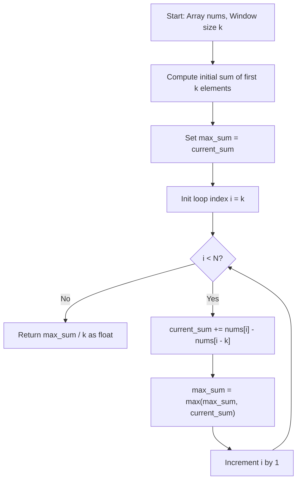

# Maximum Average Subarray I (LeetCode 643)

Detailed study notes and 5 YOE interview preparation guide on the **Sliding Window**
technique for **Maximum Average Subarray I** (LeetCode 643).

---

## 1. Core Concepts & Mathematical Foundation

### 1.1 Problem Definition
Given an integer array `nums` consisting of $N$ elements and an integer $k$, find a contiguous
subarray of length $k$ that has the maximum average value and return this value.

- **Constraints**:
  - $N == \text{len(nums)}$
  - $1 \le k \le N \le 10^5$
  - $-10^4 \le \text{nums}[i] \le 10^4$
  - Any answer with calculation error less than $10^{-5}$ will be accepted.

---

### 1.2 Mathematical Derivation & Key Insight
Let $A = [a_0, a_1, \dots, a_{N-1}]$ be the array of integers.
For any index $i$ where $k - 1 \le i < N$, the sum of the subarray of length $k$ ending at $i$ is:

$$S_k(i) = \sum_{j=i-k+1}^{i} a_j$$

The average value of this subarray is:

$$\text{Avg}_k(i) = \frac{S_k(i)}{k}$$

Since $k$ is a constant positive integer ($k > 0$), maximizing the average $\text{Avg}_k(i)$ is
mathematically equivalent to maximizing the sum $S_k(i)$:

$$\arg\max_i \left( \frac{S_k(i)}{k} \right) = \arg\max_i S_k(i)$$

Notice the recurrence relationship between consecutive window sums:

$$S_k(i) = S_k(i-1) + a_i - a_{i-k}$$

Instead of recomputing the sum of $k$ elements in $\mathcal{O}(k)$ time for each window (yielding an
$\mathcal{O}(N \cdot k)$ brute force complexity), we can update the sum in $\mathcal{O}(1)$ time by
adding the incoming element $a_i$ and subtracting the outgoing element $a_{i-k}$.

---

## 2. Algorithm Comparison & Complexity Analysis

### 2.1 Complexity Matrix

| Approach | Time | Space | Key Mechanics |
| :--- | :--- | :--- | :--- |
| Brute Force | $\mathcal{O}(N \cdot k)$ | $\mathcal{O}(1)$ | Sums $k$ items per index |
| Prefix Sum | $\mathcal{O}(N)$ | $\mathcal{O}(N)$ | $P[i] - P[i-k]$ via prefix array |
| Sliding Window | $\mathcal{O}(N)$ | $\mathcal{O}(1)$ | Single-pass rolling sum update |

---

### 2.2 Execution Flow Diagram



---

## 3. Implementations

### 3.1 Python Implementation

```python
from typing import List


class Solution:
    def findMaxAverage(self, nums: List[int], k: int) -> float:
        """Finds maximum average of a contiguous subarray of length k.

        Time Complexity: O(N) single pass across array of length N.
        Space Complexity: O(1) auxiliary space.
        """
        # Step 1: Compute initial sum for first window of length k
        current_sum = sum(nums[:k])
        max_sum = current_sum

        # Step 2: Slide the window from index k to N - 1
        for i in range(k, len(nums)):
            current_sum += nums[i] - nums[i - k]
            if current_sum > max_sum:
                max_sum = current_sum

        # Step 3: Compute maximum average
        return max_sum / k
```

---

### 3.2 Go Implementation

```go
package main

// FindMaxAverage returns maximum average value of a contiguous subarray of length k.
// Time Complexity: O(N), Space Complexity: O(1).
func FindMaxAverage(nums []int, k int) float64 {
	currentSum := 0
	for i := 0; i < k; i++ {
		currentSum += nums[i]
	}

	maxSum := currentSum
	for i := k; i < len(nums); i++ {
		currentSum += nums[i] - nums[i-k]
		if currentSum > maxSum {
			maxSum = currentSum
		}
	}

	return float64(maxSum) / float64(k)
}
```

---

## 4. Edge Cases & Pitfalls

1. **Negative Numbers Only**: e.g., `nums = [-5, -12, -6, -2]`, `k = 2`.
   - `max_sum` MUST be initialized to `current_sum`, NOT `0` or `-infinity`.
   - Incorrectly initializing `max_sum = 0` produces wrong output `0` instead of `-5.5`.

2. **$k = 1$**:
   - Window size is 1. Initial loop sums `nums[0]`.
   - Sliding loop compares individual elements `nums[i]`. Result is $\max(\text{nums}) / 1$.

3. **$k = N$**:
   - Window size equals array size. Main loop does not run. Result is $\text{sum(nums)} / N$.

4. **Floating Point Precision**:
   - Perform all addition and subtraction using integer arithmetic (`int` / `int64`).
   - Divide by `k` only at final return to prevent intermediate floating-point rounding
     accumulation errors.

5. **Integer Overflow in Fixed-Width Languages (C++/Java)**:
   - For $N = 10^5$ and $\text{nums}[i] = 10^4$, max sum is $10^9$, fitting 32-bit signed
     integer ($2 \times 10^9$).
   - If constraints were $N = 10^6$ and $\text{nums}[i] = 10^6$, max sum is $10^{12}$, requiring
     64-bit integers (`long long` in C++, `long` in Java) to avoid overflow.

---

## 5. 5 YOE Senior Technical Interview Q&A

### Q1: Why is Sliding Window preferred over Prefix Sum for LeetCode 643?
**Answer**:
Both Prefix Sum and Sliding Window achieve $\mathcal{O}(N)$ time complexity. However:
- **Prefix Sum** requires creating an auxiliary array $P$ of size $N + 1$ to store cumulative sums,
  taking $\mathcal{O}(N)$ extra space.
- **Sliding Window** tracks `current_sum` and `max_sum` in $\mathcal{O}(1)$ space.
- In system design and low-level optimization, $\mathcal{O}(1)$ space improves CPU cache locality
  and minimizes memory allocation overhead.

---

### Q2: How does integer accumulation prevent precision issues in float calculations?
**Answer**:
IEEE 754 floating-point operations can introduce rounding errors when repeatedly adding and
subtracting decimal numbers. Because all elements in `nums` are integers, the sum $S_k(i)$ is
guaranteed to be an exact integer. By maintaining integer arithmetic throughout the loop and
performing a single floating-point division at the end (`max_sum / k`), we eliminate intermediate
precision loss and maintain numerical precision within the required $10^{-5}$ tolerance.

---

### Q3: How to implement this in real-time streaming (e.g., Flink / Kafka)?
**Answer**:
In streaming architectures with continuous data streams:
1. **Sliding Time Window**: Define fixed window size $k$ with slide interval $\Delta t = 1$.
2. **State Store**: Maintain a bounded ring buffer or deque of size $k$ alongside running total.
3. **Eviction**: As event $x_{new}$ arrives, evict $x_{old}$, update sum, output average.
4. **Watermarking**: Handle late data using watermarks and event-time triggers.

---

### Q4: What if the window size $k$ is not fixed, but lies within a range $L \le k \le R$?
**Answer**:
This generalizes to **Maximum Average Subarray II** (LeetCode 644):
- Fixed window cannot solve dynamic lengths in $\mathcal{O}(N)$ as size varies.
- **Solution Approach**: Use **Binary Search on Answer** combined with Prefix Sums:
  - Guess an average $M$. Subtract $M$ from every element: $a'_i = a_i - M$.
  - Check if any subarray length $\ge L$ has sum $\ge 0$ in $\mathcal{O}(N)$ time.
  - Overall time complexity: $\mathcal{O}(N \log(\frac{\text{max} - \text{min}}{\epsilon}))$.

---

### Q5: What follow-up questions might an interviewer ask?
- **Follow-up 1**: What if we need to return the starting index of the maximum average subarray?
  - *Answer*: Track `max_start_idx`. Update `max_start_idx = i - k + 1` when sum increases.
- **Follow-up 2**: How would SIMD vectorization optimize this algorithm?
  - *Answer*: Vectorize prefix sums using SIMD. Batch load elements to perform SIMD math.
