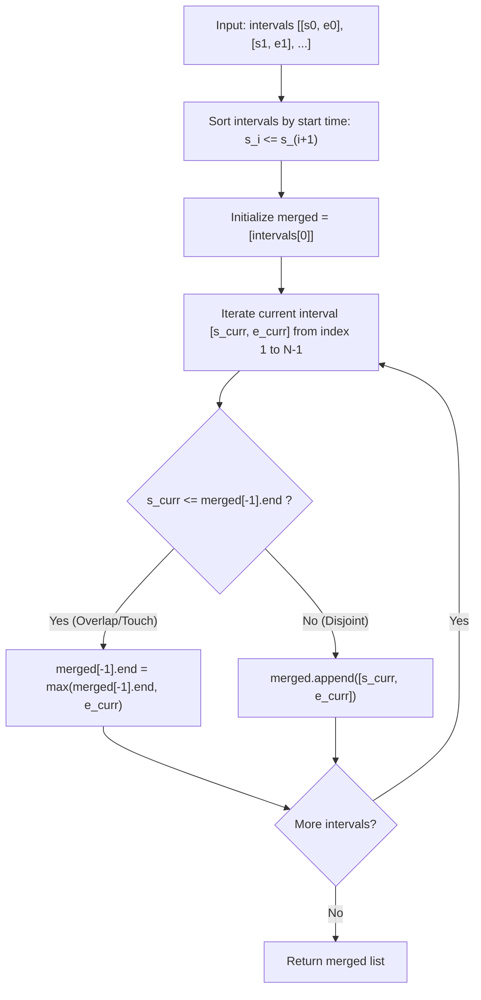

# Merge Intervals (LeetCode 56)

Comprehensive study notes and 5 YOE senior engineering interview preparation guide on the **Interval Scheduling & Merge Pattern** for **Merge Intervals** (LeetCode 56).

---

## 1. Core Concepts & Algorithmic Foundation

### 1.1 Problem Definition
Given an array of intervals where `intervals[i] = [start_i, end_i]`, merge all overlapping intervals, and return an array of the non-overlapping intervals that cover all the intervals in the input.

$$\text{Overlap Condition: } \text{Interval } A = [s_A, e_A] \text{ and } B = [s_B, e_B] \text{ overlap if } \max(s_A, s_B) \le \min(e_A, e_B)$$

When intervals are pre-sorted such that $s_A \le s_B$, the condition simplifies to:
$$s_B \le e_A \implies \text{Merged Interval } = [s_A, \max(e_A, e_B)]$$

- **Constraints**:
  - $1 \le N \le 10^4$
  - $\text{intervals}[i].\text{length} == 2$
  - $0 \le \text{start}_i \le \text{end}_i \le 10^4$
  - Optimal Time Target: $\mathcal{O}(N \log N)$ (sorting-dominated) with $\mathcal{O}(N)$ output space.

---

### 1.2 Algorithmic Mechanics

1. **Monotonic Start-Time Ordering**:
   - By sorting intervals by their start times ($s_0 \le s_1 \le \dots \le s_{N-1}$), any interval $i$ can only overlap with the active merged interval or start a new disjoint segment. It cannot overlap with any interval preceding the current merged interval.
2. **Greedy Horizon Expansion**:
   - Maintain the currently accumulating interval `[cur_start, cur_end]`.
   - For next interval `[next_start, next_end]`:
     - If `next_start <= cur_end`, the intervals overlap or touch. Extend the horizon: `cur_end = max(cur_end, next_end)`.
     - If `next_start > cur_end`, no further intervals in the sorted sequence can overlap with `[cur_start, cur_end]`. Commit `[cur_start, cur_end]` to the output and start a new active interval `[next_start, next_end]`.
3. **In-Place Compaction Option**:
   - Instead of allocating a new output list, reuse the sorted array using a two-pointer / read-write compaction technique to achieve $\mathcal{O}(1)$ auxiliary space.

---

## 2. Algorithm Approaches & Complexity Analysis

### 2.1 Complexity Matrix

| Approach | Time Complexity | Auxiliary Space | Remarks |
| :--- | :--- | :--- | :--- |
| **Connected Components (Graph BFS/DFS)** | $\mathcal{O}(N^2)$ | $\mathcal{O}(N^2)$ | Build overlap graph and find connected components; inefficient |
| **Sort + Greedy Accumulation (Standard)** | $\mathcal{O}(N \log N)$ | $\mathcal{O}(N)$ | Industry standard; highly readable, robust |
| **Sort + In-Place Compaction** | $\mathcal{O}(N \log N)$ | $\mathcal{O}(1)$ aux | Mutates input array; eliminates extra heap allocations |
| **Sweep-Line / Coordinate Array** | $\mathcal{O}(N + M)$ | $\mathcal{O}(M)$ | $M = \max(\text{end})$; efficient only when coordinate range $M$ is small |

---

### 2.2 Execution Flow Diagram



---

## 3. Implementation Patterns (Python 3.14)

### 3.1 Standard Sort & Merge (Production Grade)

```python
from typing import List


class Solution:
    def merge(self, intervals: List[List[int]]) -> List[List[int]]:
        if not intervals:
            return []

        # Sort intervals by starting boundary
        intervals.sort(key=lambda interval: interval[0])
        merged: List[List[int]] = [intervals[0]]

        for current in intervals[1:]:
            last = merged[-1]
            if current[0] <= last[1]:
                # Overlapping intervals: merge by extending boundary
                last[1] = max(last[1], current[1])
            else:
                # Disjoint interval: commit new segment
                merged.append(current)

        return merged
```

### 3.2 In-Place Compaction (Zero Heap Allocation)

```python
from typing import List


class Solution:
    def merge_in_place(self, intervals: List[List[int]]) -> List[List[int]]:
        if not intervals:
            return []

        intervals.sort(key=lambda x: x[0])
        write = 0

        for read in range(1, len(intervals)):
            if intervals[read][0] <= intervals[write][1]:
                intervals[write][1] = max(
                    intervals[write][1], intervals[read][1]
                )
            else:
                write += 1
                intervals[write] = intervals[read]

        return intervals[: write + 1]
```

---

## 4. Edge Cases & Failure Modes

1. **Empty List (`[]`) / Single Interval (`[[1, 5]]`)**: Returns `[]` or `[[1, 5]]` immediately without errors.
2. **Touching Boundaries (`[[1, 4], [4, 5]]`)**: The condition $s_B \le e_A$ handles touching intervals correctly, outputting `[[1, 5]]`.
3. **Completely Nested Intervals (`[[1, 10], [2, 5], [3, 7]]`)**: `max(last[1], current[1])` ensures internal intervals do not shrink the outer boundary.
4. **Point Intervals (`[[1, 1], [1, 2], [2, 2]]`)**: Degenerate intervals of zero width are merged consistently into `[[1, 2]]`.
5. **Reverse Sorted Input (`[[15, 18], [8, 10], [2, 6], [1, 3]]`)**: Sorting step normalizes input order before linear scan.
6. **Large Integer Coordinates ($0 \le \text{val} \le 10^9$)**: Comparison-based sorting is independent of coordinate magnitude and avoids memory explosion of bucket/sweep-line arrays.

---

## 5. 5 YOE Senior Interview Questions & Answers

### Q1: How do you handle interval merging in a real-time streaming architecture where intervals arrive continuously?
**Answer**:
In a streaming system (e.g., aggregating user booking intervals, calendar busy times, or network blackout windows), we cannot re-sort all $N$ intervals on every insertion ($\mathcal{O}(N \log N)$ would degrade throughput).

1. **Self-Balancing Binary Search Tree / Interval Tree / TreeMap (e.g., C++ `std::map`, Java `TreeMap`, Python `bintrees`)**:
   - Store merged disjoint intervals keyed by their `start` time.
   - For a newly arriving interval $[s, e]$:
     - Use `floor_key(s)` to find the interval immediately preceding or overlapping $s$.
     - Find all intervals intersecting $[s, e]$.
     - Remove overlapping intervals from the tree and insert the combined union $[ \min(s, \text{start}_{\min}), \max(e, \text{end}_{\max}) ]$.
   - **Complexity**: $\mathcal{O}(\log K + M \log K)$ amortized per insertion, where $K$ is the number of disjoint intervals in state and $M$ is the number of overlapped intervals merged.

*Follow-up*: What if the stream is distributed across multiple worker nodes?
*Answer*: Partition interval streams by bounded time buckets (e.g., epoch hour). Workers aggregate intervals locally via interval trees, and a reducer worker merges boundary intervals across bucket borders using a two-pointer merge.

---

### Q2: What is the difference between "Merge Intervals" (LeetCode 56) and "Non-overlapping Intervals" (LeetCode 435 / Interval Scheduling)?
**Answer**:
1. **Goal Difference**:
   - *Merge Intervals* aims to find the union of all intervals, extending boundaries whenever overlap occurs.
   - *Non-overlapping Intervals / Activity Selection* aims to maximize the count of mutually disjoint intervals (or minimize removals).
2. **Sorting Criteria**:
   - *Merge Intervals*: Sort by **start time** (`key=lambda x: x[0]`) so we can greedily expand the ongoing interval rightwards.
   - *Interval Scheduling (Greedy)*: Sort by **end time** (`key=lambda x: x[1]`) because finishing an activity as early as possible leaves maximum remaining time for subsequent activities.

---

### Q3: How would you find "Employee Free Time" (LeetCode 759) or Available Meeting Slots given a list of schedules?
**Answer**:
1. **Reduction to Merge Intervals**:
   - Flatten all employee schedules into a single list of busy intervals and merge them using the standard $\mathcal{O}(N \log N)$ algorithm.
   - The gaps between adjacent merged intervals represent free time:
     $$\text{Free Slot } i = [\text{merged}[i][1], \text{merged}[i+1][0]]$$
2. **Priority Queue / K-Way Merge Optimization**:
   - Since each employee's schedule is already sorted internally, we can push the first interval of each of the $K$ employees into a Min-Heap.
   - Extract the earliest start time, merge greedily, and push the next interval from that employee.
   - **Complexity**: $\mathcal{O}(N \log K)$ time and $\mathcal{O}(K)$ auxiliary space, where $N$ is total intervals and $K$ is the number of employees.

---

### Q4: When would you use a Sweep-Line / Difference Array algorithm over Sorting?
**Answer**:
1. **Trade-offs**:
   - Sweep-line with a coordinate array (or difference array $\Delta[\text{start}] += 1, \Delta[\text{end}] -= 1$) runs in $\mathcal{O}(N + M)$ time where $M = \max(\text{coordinate})$.
   - If $M \le 10^5$, coordinate array is $\mathcal{O}(N + M)$ and can outperform sorting.
   - However, if coordinates are sparse or large (e.g., $10^9$ or floating point timestamps), coordinate array creates excessive memory consumption ($\mathcal{O}(M)$ space).
   - Event-based Sweep-Line (sorting discrete start/end events: $+1$ at start, $-1$ at end) takes $\mathcal{O}(N \log N)$ time and $\mathcal{O}(N)$ space, making it identical in complexity to start-time sorting.

---

## 6. Authoritative References & Further Reading

- [LeetCode 56 — Merge Intervals Problem Specification](https://leetcode.com/problems/merge-intervals/)
- Cormen, T. H., Leiserson, C. E., Rivest, R. L., & Stein, C. (2022). *Introduction to Algorithms (4th ed.)* — Chapter 16: Greedy Algorithms (Interval Scheduling & Partitioning).
- [Python Standard Library `list.sort` / Timsort Details](https://github.com/python/cpython/blob/main/Objects/listsort.txt)
