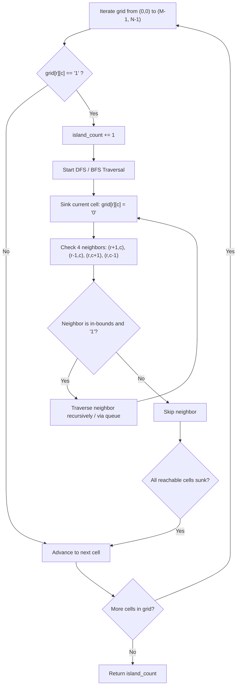

# Number of Islands (LeetCode 200)

Comprehensive study notes and 5 YOE senior engineering interview preparation guide on the **Connected Components / Matrix Graph Traversal & Union-Find Pattern** for **Number of Islands** (LeetCode 200).

---

## 1. Core Concepts & Algorithmic Foundation

### 1.1 Problem Definition
Given an $m \times n$ 2D binary grid `grid` which represents a map of `'1'`s (land) and `'0'`s (water), return the number of islands.

An **island** is surrounded by water and is formed by connecting adjacent lands horizontally or vertically (4-directional orthogonal connectivity). You may assume all four edges of the grid are surrounded by water.

$$\text{Graph Representation: } G = (V, E) \quad \text{where } V = \{(r, c) \mid \text{grid}[r][c] = '1'\}$$
$$E = \{ ((r_1, c_1), (r_2, c_2)) \mid |r_1 - r_2| + |c_1 - c_2| = 1 \text{ and } (r_1, c_1), (r_2, c_2) \in V \}$$

The objective is to find the number of **Connected Components** in the undirected graph $G$.

- **Constraints**:
  - $m == \text{grid.length}$
  - $n == \text{grid}[i].\text{length}$
  - $1 \le m, n \le 300$
  - $\text{grid}[i][j] \in \{'0', '1'\}$
  - Optimal Time Target: $\mathcal{O}(M \times N)$ visiting each cell a constant number of times.

---

### 1.2 Algorithmic Mechanics

1. **Implicit Graph Exploration**:
   - The matrix represents an implicit grid graph where vertices are coordinate pairs $(r, c)$ and edges exist between orthogonally adjacent cells $(r \pm 1, c)$ and $(r, c \pm 1)$.
2. **Flood Fill & In-Place Sinking**:
   - When an unvisited land cell $(r, c)$ is encountered during a linear scan of the grid, a new connected component is identified ($\text{island\_count} \mathrel{+}= 1$).
   - A traversal (DFS or BFS) is initiated from $(r, c)$ to visit all reachable land cells.
   - To avoid $\mathcal{O}(M \times N)$ extra space for a `visited` boolean matrix, cells can be mutated in-place by "sinking" them ($\text{grid}[r][c] = '0'$).
3. **Disjoint Set Union (DSU / Union-Find)**:
   - Treat each cell $(r, c)$ as a node with 1D index $\text{id} = r \times n + c$.
   - Initialize each land cell as an independent set of size 1.
   - For every land cell, perform `union` operations with its right and downward neighbors if they are also land.
   - Path compression and union-by-rank ensure near-constant time operations ($\mathcal{O}(\alpha(MN))$).

---

## 2. Algorithm Approaches & Complexity Analysis

### 2.1 Complexity Matrix

| Approach | Time Complexity | Auxiliary Space | Remarks |
| :--- | :--- | :--- | :--- |
| **Depth-First Search (DFS Recursive)** | $\mathcal{O}(M \times N)$ | $\mathcal{O}(M \times N)$ | Cleanest syntax; vulnerable to call stack overflow on large grids |
| **Breadth-First Search (BFS Queue)** | $\mathcal{O}(M \times N)$ | $\mathcal{O}(\min(M, N))$ | Level-by-level traversal; space bounded by maximum perimeter/diagonal |
| **Disjoint Set Union (Union-Find)** | $\mathcal{O}(M \times N \cdot \alpha(MN))$ | $\mathcal{O}(M \times N)$ | Ideal for dynamic / online stream additions of land cells |

---

### 2.2 Execution Flow Diagram



---

## 3. Implementation Patterns (Python 3.14)

### 3.1 Depth-First Search (Standard DFS)

```python
from typing import List


class Solution:
    def numIslands(self, grid: List[List[str]]) -> int:
        if not grid or not grid[0]:
            return 0

        rows, cols = len(grid), len(grid[0])
        island_count = 0

        def dfs(r: int, c: int) -> None:
            if r < 0 or r >= rows or c < 0 or c >= cols or grid[r][c] != "1":
                return
            grid[r][c] = "0"
            dfs(r + 1, c)
            dfs(r - 1, c)
            dfs(r, c + 1)
            dfs(r, c - 1)

        for r in range(rows):
            for c in range(cols):
                if grid[r][c] == "1":
                    island_count += 1
                    dfs(r, c)

        return island_count
```

### 3.2 Breadth-First Search (Queue BFS)

```python
from collections import deque
from typing import List


class Solution:
    def numIslands_bfs(self, grid: List[List[str]]) -> int:
        if not grid or not grid[0]:
            return 0

        rows, cols = len(grid), len(grid[0])
        island_count = 0
        directions = [(1, 0), (-1, 0), (0, 1), (0, -1)]

        for r in range(rows):
            for c in range(cols):
                if grid[r][c] == "1":
                    island_count += 1
                    grid[r][c] = "0"
                    queue = deque([(r, c)])

                    while queue:
                        curr_r, curr_c = queue.popleft()
                        for dr, dc in directions:
                            nr, nc = curr_r + dr, curr_c + dc
                            if 0 <= nr < rows and 0 <= nc < cols and grid[nr][nc] == "1":
                                grid[nr][nc] = "0"
                                queue.append((nr, nc))

        return island_count
```

---

## 4. Edge Cases & Failure Modes

1. **Empty or Degenerate Grids (`[]`, `[[]]`)**: Handled by immediate boundary guard returning 0.
2. **All Water (`grid` filled with `'0'`)**: Linear scan completes without triggering traversal; returns 0.
3. **All Land (`grid` filled with `'1'`)**: First cell sinks the entire grid in one traversal; returns 1.
4. **Diagonal Land Cells (`[['1', '0'], ['0', '1']]`)**: 4-directional rules ensure diagonal cells are treated as 2 distinct islands.
5. **Surrounded / Lake Enclosed Islands (Donuts)**: Outer ring sinks without corrupting internal water or interior islands.
6. **Maximum Recursion Depth in Python**: For a $300 \times 300 = 90,000$ land grid, recursive DFS can exceed `sys.getrecursionlimit()` (default 1000). BFS or iterative DFS with an explicit list stack avoids `RecursionError`.

---

## 5. 5 YOE Senior Interview Questions & Answers

### Q1: How do you handle dynamic land additions where cells transition from water (`'0'`) to land (`'1'`) in real-time (LeetCode 305 - Number of Islands II)?
**Answer**:
In an online streaming scenario where land coordinates arrive dynamically one by one, re-running DFS/BFS on the entire grid would take $\mathcal{O}(k \cdot M \cdot N)$ for $k$ queries.

1. **Disjoint Set Union (Union-Find) Dynamic Approach**:
   - Maintain a global DSU data structure.
   - For each incoming operation $(r, c)$:
     - If $(r, c)$ is already land, count remains unchanged.
     - Otherwise, mark $(r, c)$ as land and increment disjoint component count $\text{count} \mathrel{+}= 1$.
     - Check the 4 orthogonal neighbors of $(r, c)$. If neighbor $(nr, nc)$ is land, perform `union((r, c), (nr, nc))`.
     - Each successful `union` between distinct roots decrements the component count by 1.
   - **Complexity**: $\mathcal{O}(k \cdot \alpha(MN))$ total time, which is effectively $\mathcal{O}(k)$ (near $\mathcal{O}(1)$ per operation).

---

### Q2: What if the grid is massive (e.g., $10^9 \times 10^9$ matrix with sparse land, or too large to fit into single-node RAM)?
**Answer**:
1. **Sparse Coordinates (Single Machine)**:
   - Use a Hash Set of coordinates `Set[Tuple[int, int]]` containing only land cells instead of allocating a $10^9 \times 10^9$ dense matrix.
   - Iterate over set keys and run BFS/DFS looking up adjacent coordinates in $\mathcal{O}(1)$ average hash set time.
2. **Distributed MapReduce / Pregel Architecture (Multi-Machine)**:
   - Partition the large 2D space into rectangular tiles/chunks distributed across worker nodes.
   - **Phase 1 (Local Component Identification)**: Each worker runs DFS/BFS on its local chunk to find local connected components and assigns local component IDs.
   - **Phase 2 (Boundary Union-Find)**: Extract only the boundary pixels (edges) between adjacent tiles. Send boundary connectivity graph to a coordinator or run distributed DSU to merge connected components that cross tile borders.
   - **Phase 3 (Global Count)**: Subtract number of boundary merges from the sum of local components.

---

### Q3: When is In-Place Matrix Mutation acceptable in production, and what are its trade-offs?
**Answer**:
- **Benefits**: Eliminates $\mathcal{O}(M \times N)$ auxiliary memory allocation for `visited` sets or boolean arrays, maximizing CPU cache locality and lowering garbage collection overhead.
- **Risks & Anti-patterns**:
  1. **Side-Effect Pollution**: Mutating input data structures can introduce subtle bugs if upstream callers or downstream services expect the original matrix to remain immutable.
  2. **Concurrency / Thread Safety**: In multi-threaded environments where multiple workers read from a shared memory buffer or tensor, in-place mutation causes race conditions without expensive locking.
- **Production Best Practice**: If immutability is required, use a lightweight 1D `bytearray(m * n)` or a bitset to track visited state with minimal memory footprint ($1/8$ byte per cell).

---

### Q4: Compare BFS vs DFS recursion vs Iterative DFS in terms of memory footprint and performance characteristics.
**Answer**:
1. **Recursive DFS**:
   - Memory is bounded by the longest path (worst-case $\mathcal{O}(M \times N)$ for snake-like mazes).
   - In Python, risk of call stack exhaustion (`RecursionError`).
2. **Queue BFS**:
   - Memory is bounded by the wavefront / maximum perimeter of the island (worst-case $\mathcal{O}(\min(M, N))$).
   - Guarantees minimum step distances from the origin (crucial for shortest path variants).
3. **Iterative DFS (Explicit Heap Stack)**:
   - Uses an explicit `list` as a stack in heap memory, bypassing Python's call frame stack limits while maintaining DFS traversal order.

---

## 6. Authoritative References & Further Reading

- [LeetCode 200 — Number of Islands Specification](https://leetcode.com/problems/number-of-islands/)
- Cormen, T. H., Leiserson, C. E., Rivest, R. L., & Stein, C. (2022). *Introduction to Algorithms (4th ed.)* — Chapter 22: Elementary Graph Algorithms (BFS & DFS), Chapter 21: Data Structures for Disjoint Sets.
- Tarjan, R. E. (1975). *Efficiency of a Good But Not Linear Set Union Algorithm*. Journal of the ACM.
