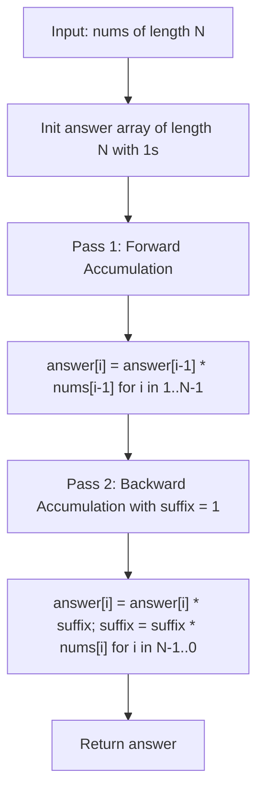

# Product of Array Except Self (LeetCode 238)

Detailed study notes and 5 YOE interview preparation guide on the **Prefix/Suffix Product Decomposition**
technique for **Product of Array Except Self** (LeetCode 238).

---

## 1. Core Concepts & Mathematical Foundation

### 1.1 Problem Definition
Given an integer array `nums`, return an array `answer` such that `answer[i]` is equal to the product
of all elements of `nums` except `nums[i]`, **without using division** and in $\mathcal{O}(N)$ time.

$$\text{answer}[i] = \prod_{j \neq i} \text{nums}[j] = \left(\prod_{j=0}^{i-1} \text{nums}[j]\right) \times \left(\prod_{j=i+1}^{N-1} \text{nums}[j]\right)$$

- **Constraints**:
  - $2 \le N \le 10^5$
  - $-30 \le \text{nums}[i] \le 30$
  - The product of any prefix or suffix fits in a 32-bit integer.
  - Follow-up: $\mathcal{O}(1)$ auxiliary space complexity (output array does not count as extra space).

---

### 1.2 Mathematical Decomposition
For any element at index $i$, the product of all other elements decomposes cleanly into two independent sub-problems:
1. **Prefix Product ($L[i]$)**: Product of all elements strictly to the left of index $i$ ($nums[0] \times \dots \times nums[i-1]$). By definition, $L[0] = 1$.
2. **Suffix Product ($R[i]$)**: Product of all elements strictly to the right of index $i$ ($nums[i+1] \times \dots \times nums[N-1]$). By definition, $R[N-1] = 1$.

$$\text{answer}[i] = L[i] \times R[i]$$

This avoids division and naturally handles zeros without special-case division-by-zero errors.

---

## 2. Algorithm Approaches & Complexity Analysis

### 2.1 Complexity Matrix

| Approach | Time Complexity | Auxiliary Space | Remarks |
| :--- | :--- | :--- | :--- |
| **Division Operator (Naive)** | $\mathcal{O}(N)$ | $\mathcal{O}(1)$ | Violates problem constraint; breaks on $\ge 1$ zeros |
| **Prefix & Suffix Arrays** | $\mathcal{O}(N)$ | $\mathcal{O}(N)$ | Intuitive, 3 passes (left, right, combine) |
| **Two-Pass In-Place Accumulator** | $\mathcal{O}(N)$ | $\mathcal{O}(1)$ | Optimal; stores prefix in output, accumulates suffix via variable |

---

### 2.2 Execution Flow Diagram



---

## 3. Implementation Patterns (Python 3.14)

### 3.1 Optimal Two-Pass Solution ($\mathcal{O}(N)$ Time, $\mathcal{O}(1)$ Auxiliary Space)

```python
from typing import List


class Solution:
    def productExceptSelf(self, nums: List[int]) -> List[int]:
        n = len(nums)
        answer = [1] * n

        # Step 1: Compute prefix products in answer array
        for i in range(1, n):
            answer[i] = answer[i - 1] * nums[i - 1]

        # Step 2: Multiply by running suffix product from the right
        suffix = 1
        for i in range(n - 1, -1, -1):
            answer[i] *= suffix
            suffix *= nums[i]

        return answer
```

---

## 4. Edge Cases & Failure Modes

1. **Multiple Zeros (`[0, 4, 0]`, `[0, 0]`)**:
   - Every position except the zero indices would be 0, but since there are $\ge 2$ zeros, the product except self is `0` for all elements. The prefix/suffix product handles this without branching.
2. **Single Zero (`[-1, 1, 0, -3, 3]`)**:
   - All positions receive `0` except the index containing the `0`, which receives the product of all non-zero elements.
3. **Negative Numbers (`[-1, -2, -3, -4]`)**:
   - Proper sign alternation is maintained across left and right products.
4. **Minimum Array Length ($N=2$)**:
   - Example: `[5, 2]` produces `[2, 5]`. Loop boundaries must correctly handle $N=2$.

---

## 5. 5 YOE Senior Interview Questions & Answers

### Q1: Why is the division approach considered fragile in production systems even if division was allowed?
**Answer**:
The division approach computes $P = \prod \text{nums}[i]$ and sets $\text{answer}[i] = P / \text{nums}[i]$.
In production engineering, this suffers from several structural flaws:
1. **Division by Zero**: Requires complex conditional branches for zero counts ($0$, $1$, or $\ge 2$ zeros).
2. **Numerical Overflow / Precision Loss**: In fixed-width integer environments or floating point representations, multiplying all elements upfront can easily exceed integer bounds ($> 2^{63}-1$ or floating point overflow), whereas individual prefix/suffix sub-products may stay within bounded limits.
3. **Algebraic Non-Invertibility**: In generalized algebraic structures (e.g., matrices, finite rings, non-invertible transformations), division or multiplicative inverse may not exist, whereas prefix/suffix multiplication only requires associativity.

---

### Q2: How does this prefix/suffix decomposition relate to parallel prefix algorithms (e.g., Blelloch Scan) in distributed data processing?
**Answer**:
Prefix-suffix decomposition is isomorphic to associative scan operations used in distributed systems (MapReduce/Spark) and GPU computing:
- The prefix product is an **inclusive/exclusive prefix scan** with the binary associative operator $\times$.
- In parallel computing, exclusive scan is computed in $\mathcal{O}(\log N)$ depth using an Up-Sweep (reduce tree) and Down-Sweep phase.
- Calculating `productExceptSelf` in parallel across partitioned nodes involves distributing chunk products, running an all-gather/scan on chunk boundaries, and broadcasting boundary products to compute each partition's result independently.

---

### Q3: How would you modify this solution if the array was a stream of numbers too large to fit in memory?
**Answer**:
If $N$ is too large to fit in memory or represents an append-only stream:
1. Two-pass sequential streaming requires storing either the stream to disk or maintaining prefix products on disk.
2. If queries for `productExceptSelf(i)` are made ad-hoc, store checkpointed prefix products in a distributed log (like Kafka/RocksDB) and query range product queries using a Segment Tree or Fenwick Tree over invertible/semi-group values.
3. For streaming sliding windows of size $W$, maintain a queue with running product or double-stack queue (amortized $\mathcal{O}(1)$ without division) to prevent degradation from zero elements.

---

### Q4: What are the cache locality and memory layout implications between the two implementations?
**Answer**:
- **Separate Arrays (`prefix` and `suffix`)**: Allocates $2 \times N$ additional pointers/integers, causing higher memory allocation overhead and cache pressure (3 distinct memory buffers being read/written).
- **In-Place (`answer` + scalar `suffix`)**: Only allocates the single required return buffer ($N$ integers).
  - Forward pass sequentially accesses `answer` (streaming write, cache friendly, prefetcher friendly).
  - Backward pass sequentially reads in reverse (`nums[i]` and `answer[i]`), which modern hardware L1/L2 hardware prefetchers easily recognize and stream without cache misses.
