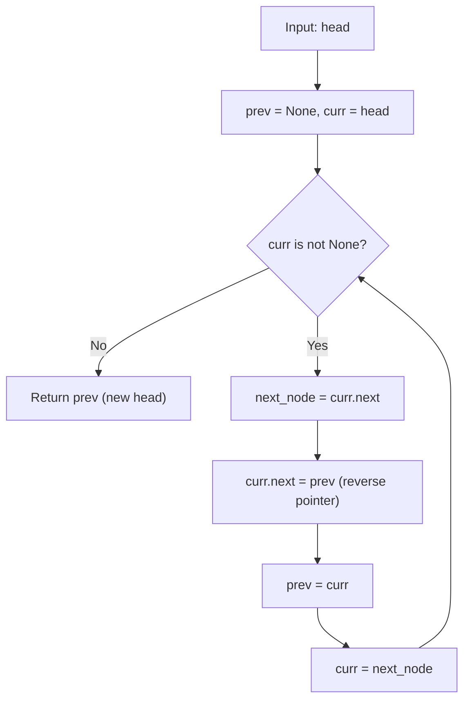

# Reverse Linked List (LeetCode 206)

Comprehensive study notes and 5 YOE senior engineering interview preparation guide on the **In-Place Pointer Manipulation & Recursive Subproblem Patterns** for **Reverse Linked List** (LeetCode 206).

---

## 1. Core Concepts & Algorithmic Foundation

### 1.1 Problem Definition
Given the `head` of a singly linked list, reverse the list, and return the reversed list's head.

- **Constraints**:
  - The number of nodes in the list is in the range $[0, 5000]$.
  - $-5000 \le \text{Node.val} \le 5000$
  - Optimal Time Target: $\mathcal{O}(N)$
  - Optimal Auxiliary Space Target: $\mathcal{O}(1)$

---

### 1.2 Algorithmic Mechanics

1. **Three-Pointer Iterative Technique**:
   - Maintain three reference pointers: `prev`, `curr`, and `next_node`.
   - `prev` tracks the tail of the newly reversed sublist (initialized to `None`).
   - `curr` points to the node currently being redirected (initialized to `head`).
   - `next_node` temporarily buffers `curr.next` before mutating pointers to prevent reference loss.
   - Core mutation: `curr.next = prev`, then advance `prev = curr` and `curr = next_node`.

2. **Recursive Traversal & Post-Order Link Inversion**:
   - Decompose into the base case and recurrence relation:
     - **Base Case**: If `head is None` or `head.next is None`, return `head`.
     - **Recurrence**: Recursively reverse the sublist starting at `head.next`. Let `new_head` be the returned head of the reversed suffix.
     - **Link Inversion**: `head.next.next = head` redirects the successor node back to `head`.
     - **Link Severing**: `head.next = None` breaks the original forward pointer to eliminate cycles.
     - Return `new_head` propagated from the base case.

3. **Key Invariant**:
   - At the beginning of each iteration, `prev` points to the head of the already reversed prefix, and `curr` points to the head of the remaining unreversed suffix.

---

## 2. Algorithm Approaches & Complexity Analysis

### 2.1 Complexity Matrix

| Approach | Time Complexity | Auxiliary Space | Remarks |
| :--- | :--- | :--- | :--- |
| **Iterative 3-Pointer** | $\mathcal{O}(N)$ | $\mathcal{O}(1)$ | Optimal; in-place pointer manipulation |
| **Recursive (Post-Order)** | $\mathcal{O}(N)$ | $\mathcal{O}(N)$ | Call stack depth proportional to list length |
| **Auxiliary Stack / Array** | $\mathcal{O}(N)$ | $\mathcal{O}(N)$ | Reconstruct or re-link from stack; non-optimal |

---

### 2.2 Execution Flow Diagram (Iterative 3-Pointer)



---

## 3. Implementation Patterns (Python 3.14)

### 3.1 Iterative 3-Pointer In-Place (Optimal)

```python
from typing import Optional


class ListNode:
    def __init__(self, val: int = 0, next: Optional["ListNode"] = None):
        self.val = val
        self.next = next


class Solution:
    def reverse_list(self, head: Optional[ListNode]) -> Optional[ListNode]:
        prev: Optional[ListNode] = None
        curr = head

        while curr is not None:
            next_node = curr.next
            curr.next = prev
            prev = curr
            curr = next_node

        return prev
```

### 3.2 Recursive Post-Order Inversion

```python
from typing import Optional


class Solution:
    def reverse_list_recursive(self, head: Optional[ListNode]) -> Optional[ListNode]:
        if head is None or head.next is None:
            return head

        new_head = self.reverse_list_recursive(head.next)
        head.next.next = head
        head.next = None

        return new_head
```

---

## 4. Edge Cases & Failure Modes

1. **Empty List (`head = None`)**:
   - Both iterative and recursive checks immediately return `None` without dereferencing `None.next`.
2. **Single-Node List (`[1]`)**:
   - Iterative: loop executes once, setting `1.next = None` and returning node `1`.
   - Recursive: base case `head.next is None` immediately triggers, returning node `1`.
3. **Two-Node List (`[1, 2]`)**:
   - Tests pointer redirection boundaries and confirms the second node becomes the new head.
4. **Duplicate Values (`[2, 2, 2]`)**:
   - Verifies logic depends strictly on object references (`is not None`), not node values.
5. **Call Stack Exhaustion ($N > 1000$)**:
   - Python defaults to a recursion limit of 1000 (`sys.getrecursionlimit()`). The recursive approach will raise `RecursionError` on lists of length $\ge 1000$ unless `sys.setrecursionlimit()` is adjusted. The iterative approach is safe for arbitrary list lengths.

---

## 5. 5 YOE Senior Interview Questions & Answers

### Q1: In production systems, why is the iterative approach strictly preferred over recursive reversal in Python?

**Answer**:
1. **Recursion Depth Limits**: Python does not perform tail-call optimization (TCO). In CPython, each recursive call allocates a C stack frame (`PyFrameObject`). The standard recursion limit is 1000 (`sys.getrecursionlimit()`). A list with 1001 elements causes a `RecursionError`.
2. **Memory Overhead**: The iterative version operates with $\mathcal{O}(1)$ auxiliary memory (three pointer variables). The recursive version consumes $\mathcal{O}(N)$ stack memory. For $N = 5000$, this wastes memory unnecessarily.
3. **Instruction Cache Locality**: The iterative loop executes tightly within CPU instruction caches, avoiding call/return frame overhead and function dispatch latency.

*Follow-up*: Can tail call recursion be made $\mathcal{O}(1)$ space in languages that support TCO?
*Answer*: Yes, in languages like Scala, Scheme, or Clang/GCC with optimization flags enabled, a tail-recursive helper (`def helper(curr, prev)`) can be compiled down into a loop without consuming extra stack frames. However, in Python, Guido van Rossum explicitly rejected TCO to preserve accurate stack traces for debugging.

---

### Q2: How do you solve "Reverse Linked List II" (LeetCode 92), where only nodes from position $m$ to $n$ are reversed in a single pass?

**Answer**:
Use a dummy node to handle reversals starting at index 1 gracefully, then reposition pointers:

```python
def reverse_between(
    head: Optional[ListNode], left: int, right: int
) -> Optional[ListNode]:
    if not head or left == right:
        return head

    dummy = ListNode(0, head)
    prev = dummy

    for _ in range(left - 1):
        prev = prev.next

    curr = prev.next
    for _ in range(right - left):
        temp = curr.next
        curr.next = temp.next
        temp.next = prev.next
        prev.next = temp

    return dummy.next
```

**Key Technique**: Instead of fully detaching sublists, perform head insertion within the $[left, right]$ subsegment: repeatedly move `curr.next` to `prev.next`. This guarantees a single pass with $\mathcal{O}(1)$ extra memory.

---

### Q3: How does this fundamental pattern scale to "Reverse Nodes in k-Group" (LeetCode 25)?

**Answer**:
**LeetCode 25** requires reversing every $k$ consecutive nodes; remaining nodes $(< k)$ at the end stay unreversed.

1. **Lookahead Count**: Traverse $k$ nodes ahead to check if at least $k$ nodes exist. If fewer than $k$ remain, terminate.
2. **Reverse Subsegment**: Re-use the standard 3-pointer reversal for exactly $k$ iterations.
3. **Splice & Connect**: Connect the previous group's tail to the new group's head, and attach the current group's tail to the remaining unreversed list.
4. **Time & Space**: Runs in $\mathcal{O}(N)$ time and $\mathcal{O}(1)$ auxiliary space.

---

### Q4: How would you reverse or mutate a linked list in a concurrent, multi-threaded environment?

**Answer**:
Singly linked lists are not thread-safe for in-place structural mutations:

1. **Race Conditions**: Two threads traversing while pointers are being inverted can enter infinite loops or access detached nodes.
2. **Coarse-Grained Locking**: Acquire a mutex on the entire list container before reversal (`threading.Lock`). Simple, but degrades concurrency.
3. **Fine-Grained Hand-over-Hand Locking**: Lock individual nodes during traversal. While useful for search/insert, reversing requires global synchronization because pointers flip direction.
4. **Copy-on-Write (Immutability)**: Produce a new reversed linked list instead of in-place mutation. Readers continue lock-free on the previous version, and an atomic reference swap (`CAS` / Compare-And-Swap) commits the new head.
5. **Lock-Free Concurrent Lists (Harris List)**: Lock-free linked lists rely on atomic CAS operations and logical deletion markers. Full in-place reversal is rarely done in lock-free architectures due to the combinatorial complexity of atomic multi-pointer updates; instead, double-ended queues or skip lists are preferred.

---

### Q5: What happens if `reverse_list` is executed on a linked list containing a cycle?

**Answer**:
1. **Infinite Loop**: If the list contains a cycle (e.g., node 3 points back to node 1), the `while curr is not None:` condition will never terminate.
2. **Defensive Programming**: In production systems handling untrusted linked structures, precede reversal with **Floyd's Tortoise and Hare cycle detection** (LeetCode 141) or use a visited set/counter bound. If a cycle is detected, raise a `ValueError` or break the cycle before attempting reversal.

---

## 6. Authoritative References & Further Reading

- [LeetCode 206 -- Reverse Linked List Problem Specification](https://leetcode.com/problems/reverse-linked-list/)
- [LeetCode 92 -- Reverse Linked List II](https://leetcode.com/problems/reverse-linked-list-ii/)
- [LeetCode 25 -- Reverse Nodes in k-Group](https://leetcode.com/problems/reverse-nodes-in-k-group/)
- Cormen, T. H., Leiserson, C. E., Rivest, R. L., & Stein, C. (2022). *Introduction to Algorithms (4th ed.)* -- Elementary Data Structures, Singly Linked Lists.
- [Python Documentation -- sys.getrecursionlimit()](https://docs.python.org/3/library/sys.html#sys.getrecursionlimit)
