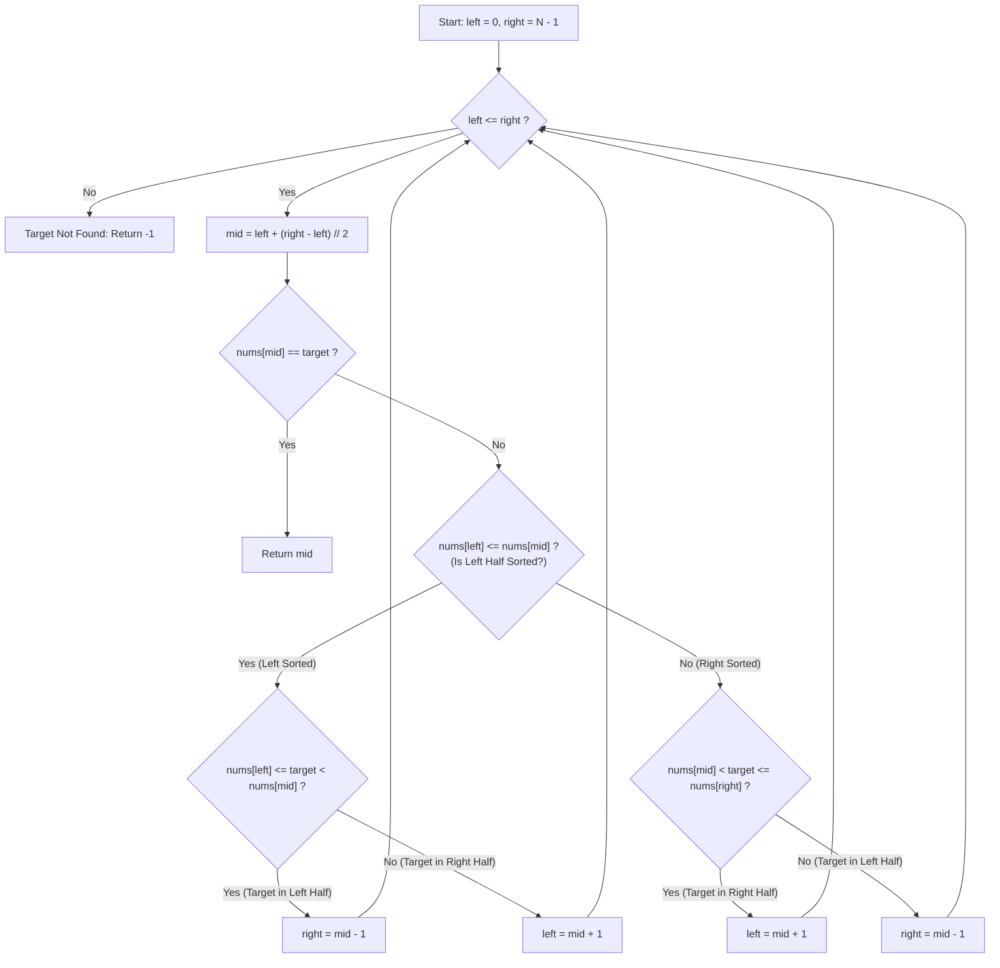

# Search in Rotated Sorted Array (LeetCode 33)

Comprehensive study notes and 5 YOE senior engineering interview preparation guide on the **Modified Binary Search Pattern** for **Search in Rotated Sorted Array** (LeetCode 33).

---

## 1. Core Concepts & Algorithmic Foundation

### 1.1 Problem Definition
Given an integer array `nums` sorted in ascending order with distinct values, rotated at an unknown pivot index $k$ ($1 \le k < \text{len}(nums)$), and an integer `target`, return the 0-indexed position of `target` if present, or `-1` if not found.

$$\text{Original: } [0, 1, 2, 4, 5, 6, 7] \xrightarrow{\text{rotate at } k=3} [4, 5, 6, 7, 0, 1, 2]$$

- **Constraints**:
  - $1 \le \text{len}(nums) \le 5000$
  - $-10^4 \le nums[i], \text{target} \le 10^4$
  - All elements are **strictly distinct** (guaranteed unique).
  - Target Time Complexity: $\mathcal{O}(\log N)$
  - Target Auxiliary Space: $\mathcal{O}(1)$

---

### 1.2 The Fundamental Invariant of Rotated Sorted Arrays

When any monotonically ascending array is partitioned and rotated once:
1. **The Half-Sorted Property**: Dividing the array at any arbitrary midpoint index `mid` guarantees that **at least one of the two halves ($[left, mid]$ or $[mid, right]$) is monotonically sorted**.
2. **Identifying the Sorted Half**:
   - If `nums[left] <= nums[mid]`: The **left subarray** $[left, mid]$ is sorted.
   - If `nums[left] > nums[mid]`: The **right subarray** $[mid, right]$ is sorted.
3. **Deterministic Pruning**:
   - If a subarray $[L, R]$ is sorted, verifying whether `target` falls within $[nums[L], nums[R]]$ is an $\mathcal{O}(1)$ boundary check:
     $$\text{In bounds} \iff nums[L] \le \text{target} \le nums[R]$$
   - If `target` is within the sorted range, prune the opposite half.
   - If `target` is outside the sorted range, it must reside in the rotated (unsorted) half; prune the sorted half.

---

## 2. Algorithm Approaches & Complexity Analysis

### 2.1 Complexity Matrix

| Approach | Time Complexity | Auxiliary Space | Remarks |
| :--- | :--- | :--- | :--- |
| **Linear Scan (Brute Force)** | $\mathcal{O}(N)$ | $\mathcal{O}(1)$ | Fails interview requirement of $\mathcal{O}(\log N)$ |
| **One-Pass Modified Binary Search** | $\mathcal{O}(\log N)$ | $\mathcal{O}(1)$ | Single loop, evaluates sorted half dynamically |
| **Two-Pass Binary Search (Find Pivot first)** | $\mathcal{O}(\log N)$ | $\mathcal{O}(1)$ | Step 1: find min element index $p$; Step 2: binary search in $[0, p-1]$ or $[p, N-1]$ |

---

### 2.2 Execution Flow Diagram (One-Pass Binary Search)



---

## 3. Implementation Patterns (Python 3.14)

### 3.1 One-Pass Modified Binary Search (Production Grade)

```python
from typing import List


class Solution:
    def search(self, nums: List[int], target: int) -> int:
        """
        One-pass modified binary search.
        Time: O(log N), Space: O(1).
        """

        left, right = 0, len(nums) - 1

        while left <= right:
            mid = left + (right - left) // 2

            if nums[mid] == target:
                return mid

            # Check if left half is monotonically sorted
            if nums[left] <= nums[mid]:
                if nums[left] <= target < nums[mid]:
                    right = mid - 1
                else:
                    left = mid + 1
            # Otherwise, right half is monotonically sorted
            else:
                if nums[mid] < target <= nums[right]:
                    left = mid + 1
                else:
                    right = mid - 1

        return -1
```

### 3.2 Two-Pass Binary Search (Pivot Index Decoupling)

```python
from typing import List


class Solution:
    def search_two_pass(self, nums: List[int], target: int) -> int:
        """
        Two-pass binary search:
        1. Find smallest element index (pivot).
        2. Binary search on the valid partition.
        Time: O(log N), Space: O(1).
        """

        n = len(nums)
        left, right = 0, n - 1

        # Phase 1: Locate pivot (index of minimum value)
        while left < right:
            mid = left + (right - left) // 2
            if nums[mid] > nums[right]:
                left = mid + 1
            else:
                right = mid

        pivot = left

        # Phase 2: Narrow search bounds based on target
        if nums[pivot] <= target <= nums[n - 1]:
            left, right = pivot, n - 1
        else:
            left, right = 0, pivot - 1

        # Phase 3: Standard binary search
        while left <= right:
            mid = left + (right - left) // 2
            if nums[mid] == target:
                return mid
            if nums[mid] < target:
                left = mid + 1
            else:
                right = mid - 1

        return -1
```

---

## 4. Common Pitfalls & Edge Cases

1. **Integer Overflow in Mid Calculation**:
   - While Python handles arbitrarily large integers, in C++/Java/Go `(left + right) // 2` can overflow signed 32-bit integers.
   - Always use `mid = left + (right - left) // 2`.
2. **Boundary Inequality Checks (`<=` vs `<`)**:
   - When checking if target is in the left sorted half: `nums[left] <= target < nums[mid]`.
   - `nums[left] <= target` includes equality because `nums[left]` is within the range, whereas `target < nums[mid]` is strictly less since `nums[mid] == target` was already handled.
3. **Single and Two Element Arrays**:
   - `[1]`, target `0` $\rightarrow -1$
   - `[3, 1]`, target `1` $\rightarrow 1$
   - Ensure loop condition `while left <= right:` handles single-element termination properly.
4. **Duplicate Elements (LeetCode 81 Variant)**:
   - When duplicates are present (e.g., `[1, 0, 1, 1, 1]`), `nums[left] == nums[mid] == nums[right]` destroys the ability to deduce which half is sorted in $\mathcal{O}(1)$.
   - Degrades worst-case complexity to $\mathcal{O}(N)$.

---

## 5. Senior (5 YOE) Interview Questions & Expert Answers

### Q1: Why does comparing `nums[left] <= nums[mid]` guarantee the left half is sorted, and why is `<=` necessary instead of `<`?

**Expert Answer**:
In a rotated sorted array of unique elements, the rotation inflection point (the drop from maximum to minimum) can only occur in one location.
- If `nums[left] <= nums[mid]`, there cannot be a drop between `left` and `mid` (otherwise `nums[mid]` would have wrapped around and been strictly less than `nums[left]`). Thus, all elements from `left` to `mid` form a continuous strictly increasing sequence.
- The equality `=` is essential for the case where `left == mid` (which occurs when the search window has shrunk to 1 or 2 elements, such as `[3, 1]` where `left = 0, mid = 0`). In this case, `nums[left] == nums[mid]`, and treating the single element at `mid` as a sorted left half allows the algorithm to correctly branch into the right half.

**Interviewer Follow-up**:
*What happens if you compare `nums[mid] <= nums[right]` instead?*
*Answer*: Comparing `nums[mid] <= nums[right]` is equally valid to identify if the **right** half is sorted. Both formulations are duals of each other.

---

### Q2: Compare the One-Pass approach vs. the Two-Pass approach in terms of maintainability, branch prediction, and real-world system design.

**Expert Answer**:
- **One-Pass**:
  - **Pros**: Fewer instructions in total (at most $\approx \lceil \log_2 N \rceil$ comparisons), slightly lower constant factor.
  - **Cons**: Nested conditional branching inside the loop body increases cognitive complexity and potential for off-by-one boundary bugs.
- **Two-Pass**:
  - **Pros**: **Separation of Concerns**. Phase 1 finds the array partition boundary / minimum (reusable as `findMin` in LeetCode 153). Phase 2 is standard binary search. Code is significantly easier to unit test, debug, and reason about.
  - **Cons**: Performs up to $2 \log_2 N$ comparisons (one search for pivot, one search for element).
- **Production Analogy**:
  - In distributed ring architectures (e.g., consistent hashing in Apache Cassandra or DynamoDB where nodes form a sorted ring), two-pass lookups mirror locating the token partition boundary first and then executing the binary search on partition ranges.

---

### Q3: How do you modify this algorithm if the array contains duplicates (LeetCode 81: Search in Rotated Sorted Array II)? What is the mathematical lower bound on time complexity?

**Expert Answer**:
When duplicates are allowed (e.g., `nums = [1, 0, 1, 1, 1]` or `nums = [1, 1, 1, 0, 1]`), having `nums[left] == nums[mid] == nums[right]` makes it mathematically impossible to determine whether the pivot is in the left half or the right half.

To handle this:
1. When `nums[left] == nums[mid] == nums[right]`, we increment `left += 1` and decrement `right -= 1` to shrink the ambiguous search window.
2. **Complexity Impact**:
   - Best / Average case: $\mathcal{O}(\log N)$ when elements are distinct enough to guide binary partitioning.
   - Worst case: $\mathcal{O}(N)$ when all elements are identical except one (e.g., `[1, 1, 1, 1, 2, 1, 1]`), because we may discard one element per iteration.
   - Information theory dictates that finding a target in an unguided duplicate array requires inspecting every element in the worst case ($\Omega(N)$).

---

### Q4: Scenario: You are building an in-memory time-series index for a high-frequency trading buffer with a circular ring buffer that overwrites old data. How does this algorithm apply?

**Expert Answer**:
A circular fixed-capacity buffer storing monotonic timestamps $T_0, T_1, \dots, T_k$ that overwrites old slots upon overflow creates an in-memory array that is exactly a **rotated sorted array**:
- The write pointer `head` marks the rotation pivot (oldest record is at `head`, newest at `head - 1 mod Cap`).
- If seeking a historical metric by timestamp $T_{\text{target}}$:
  1. We know the pivot index `head` directly from the buffer metadata ($\mathcal{O}(1)$ pivot location).
  2. We map virtual monotonic indices $[0, N-1]$ to physical array indices via `physical_idx = (head + virtual_idx) % capacity`.
  3. Binary search is executed over the virtual index range $[0, N-1]$, yielding pure $\mathcal{O}(\log N)$ time with zero branching complexity on sorted halves.

---

### Q5: How would you implement this with bitwise operations or without conditional branching for SIMD vectorization?

**Expert Answer**:
While standard binary search branches on conditions, branch mispredictions can cause pipeline stalls on modern superscalar CPUs (costing 10-20 cycles per mispredict).
- Branchless binary search uses conditional moves (`CMOV` in x86-64 assembly) or arithmetic mask calculation:
  ```python
  # Branchless index update concept
  step = length // 2
  mid = base + step
  base = base + step if nums[mid] < target else base
  ```
- For rotated search, we can compute the boolean predicate masks:
  - `is_left_sorted = nums[left] <= nums[mid]`
  - `in_left_range = (nums[left] <= target) & (target < nums[mid])`
  - Combine the boolean flags to compute step offsets using arithmetic masks rather than nested `if/else` jumps, minimizing CPU branch misprediction penalties.

---

## 6. References & Authoritative Links

- [LeetCode 33: Search in Rotated Sorted Array](https://leetcode.com/problems/search-in-rotated-sorted-array/)
- [LeetCode 81: Search in Rotated Sorted Array II (Duplicates)](https://leetcode.com/problems/search-in-rotated-sorted-array-ii/)
- [LeetCode 153: Find Minimum in Rotated Sorted Array](https://leetcode.com/problems/find-minimum-in-rotated-sorted-array/)
- [Binary Search Algorithm - Knuth, TAOCP Vol 3: Sorting and Searching](https://en.wikipedia.org/wiki/The_Art_of_Computer_Programming)
- [Bender, M. A. et al. - Cache-Oblivious Search Trees and Branchless Binary Searches](https://en.wikipedia.org/wiki/Binary_search_algorithm)
