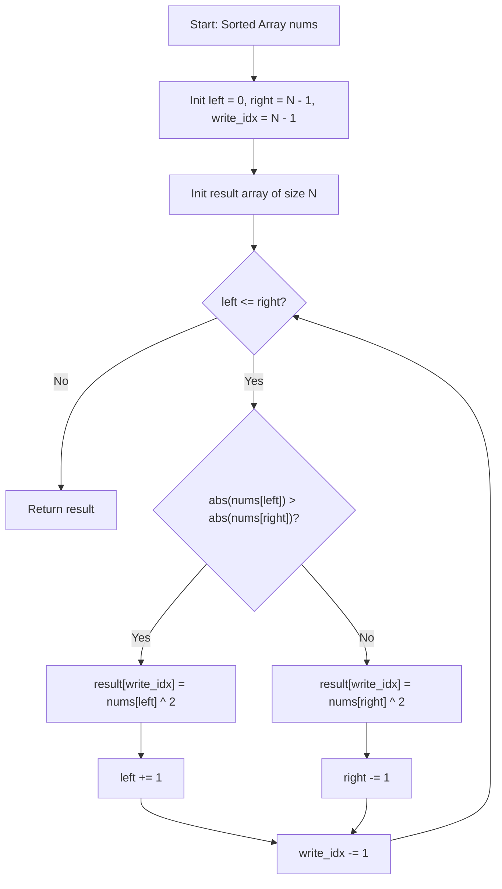

# Squares of a Sorted Array (LeetCode 977)

Detailed study notes and 5 YOE interview preparation guide on the **Two-Pointer**
technique for **Squares of a Sorted Array** (LeetCode 977).

---

## 1. Core Concepts & Mathematical Foundation

### 1.1 Problem Definition
Given an integer array `nums` sorted in non-decreasing order, return an array of the
squares of each number sorted in non-decreasing order.

- **Constraints**:
  - $1 \le N \le 10^4$
  - $-10^4 \le \text{nums}[i] \le 10^4$
  - `nums` is sorted in non-decreasing order.

---

### 1.2 Mathematical Derivation & Key Insight
Let $A = [a_0, a_1, \dots, a_{N-1}]$ be a sorted array where $a_0 \le a_1 \le \dots \le a_{N-1}$.

When applying the square mapping $f(x) = x^2$:
- The function $f(x) = x^2$ is strictly decreasing for $x < 0$ and strictly increasing for
  $x > 0$.
- The absolute value magnitude $|x|$ determines the squared value $x^2 = |x|^2$.
- Because $A$ is sorted, the maximum absolute values $|a_i|$ are located at the outer
  boundaries of the array: index $0$ (most negative) or index $N-1$ (most positive).

Therefore, for any subsegment of the array bounded by indices $L$ and $R$:

$$\max_{L \le i \le R} (a_i^2) = \max\left(a_L^2, a_R^2\right)$$

This monotonic property at the extremities enables a **Two-Pointer** algorithm that fills the
output array from right to left in $\mathcal{O}(N)$ time.

---

## 2. Algorithm Comparison & Complexity Analysis

### 2.1 Complexity Matrix

| Approach | Time | Space | Key Mechanics |
| :--- | :--- | :--- | :--- |
| Square & Sort | $\mathcal{O}(N \log N)$ | $\mathcal{O}(N)$ | Timsort on squared values |
| Partition & Merge | $\mathcal{O}(N)$ | $\mathcal{O}(N)$ | Zero split, square, 2-way merge |
| Two-Pointer Outer | $\mathcal{O}(N)$ | $\mathcal{O}(N)$ | Compare ends, fill right-to-left |

---

### 2.2 Execution Flow Diagram



---

## 3. Implementations

### 3.1 Python Implementation

```python
from typing import List


class Solution:
    def sortedSquares(self, nums: List[int]) -> List[int]:
        """Computes sorted squares of a sorted array in O(N) time and O(N) space.

        Uses a two-pointer approach from both ends moving inward.
        """
        n = len(nums)
        result = [0] * n
        left = 0
        right = n - 1
        write_idx = n - 1

        while left <= right:
            left_sq = nums[left] * nums[left]
            right_sq = nums[right] * nums[right]

            if left_sq > right_sq:
                result[write_idx] = left_sq
                left += 1
            else:
                result[write_idx] = right_sq
                right -= 1
            write_idx -= 1

        return result
```

---

### 3.2 Go Implementation

```go
package main

// SortedSquares returns an array of squares sorted in non-decreasing order.
// Runs in O(N) time complexity and O(N) space complexity.
func SortedSquares(nums []int) []int {
	n := len(nums)
	result := make([]int, n)
	left := 0
	right := n - 1

	for writeIdx := n - 1; writeIdx >= 0; writeIdx-- {
		leftSq := nums[left] * nums[left]
		rightSq := nums[right] * nums[right]

		if leftSq > rightSq {
			result[writeIdx] = leftSq
			left++
		} else {
			result[writeIdx] = rightSq
			right--
		}
	}

	return result
}
```

---

## 4. Edge Cases & Pitfalls

1. **All Non-Negative Numbers**: `[0, 1, 2, 3, 10]`
   - `nums[right]^2` is always greater than or equal to `nums[left]^2`.
   - The right pointer decrements all the way to `left`.
2. **All Negative Numbers**: `[-10, -5, -2, -1]`
   - `nums[left]^2` is always greater than `nums[right]^2`.
   - The left pointer increments all the way to `right`.
3. **Single Element**: `[-5]` or `[3]`
   - `left == right == 0`. Loop runs once, populating `result[0]`.
4. **Duplicate Values & Symmetric Negatives**: `[-3, -3, 0, 3, 3]`
   - Equal squared values trigger the `else` branch, decrementing `right` correctly.
5. **Integer Overflow**:
   - For $-10^4 \le \text{nums}[i] \le 10^4$, max square is $10^8$ (fits 32-bit signed int).
   - If bounds were $[-10^9, 10^9]$, max square is $10^{18}$ (requires `int64` / `long long`).

---

## 5. 5 YOE Senior Technical Interview Q&A

### Q1: Why fill the result array backwards instead of forwards?
**Answer**:
Because the input array is sorted, the elements with largest absolute magnitudes lie at extreme
ends ($i=0$ and $i=N-1$). We can determine the largest remaining square at each step in
$\mathcal{O}(1)$ time. If filling forwards, the minimum square resides near the zero crossover
point. Finding that crossover requires binary search ($\mathcal{O}(\log N)$), followed by expanding
two pointers outwards. Filling backwards requires zero pre-processing, yielding a clean 1-pass
$\mathcal{O}(N)$ solution.

---

### Q2: Is an in-place $\mathcal{O}(1)$ space solution possible for this problem?
**Answer**:
Producing an in-place $\mathcal{O}(1)$ auxiliary space solution in $\mathcal{O}(N)$ time is
non-trivial:
- Standard approaches use an output array of size $N$, which is optimal
  ($\mathcal{O}(N)$ time/space).
- An in-place modification in $\mathcal{O}(N)$ time requires replacing negative numbers with
  absolute values, then applying an in-place array rotation/merge algorithm, which can introduce
  higher overhead or complicate cash locality compared to allocated output.

---

### Q3: How would you process a dataset of 100 GB of sorted numbers using system design?
**Answer**:
When data exceeds memory (Out-of-Core Processing):
1. **Partitioning**: Split the 100 GB dataset into chunks across MapReduce or Spark worker nodes.
2. **Local Two-Pointer**: Each worker processes its sorted slice using the two-pointer approach.
3. **External Merge Sort**: Merge chunk outputs using a Min-Heap / K-way Merge streaming pipeline
   to write the final sorted output without exceeding RAM capacity.

---

### Q4: How can modern CPU hardware (SIMD / AVX-512) optimize this operation?
**Answer**:
For large contiguous arrays:
1. **Vectorized Squaring**: SIMD instructions (`_mm256_mul_epi32` or AVX-512 `_mm512_mul_epi32`)
   square 8 to 16 integers simultaneously per cycle.
2. **Stream Partitioning**: Find zero split index $K$ via SIMD, forming positive stream (sorted)
   and negative stream (reversed & squared).
3. **SIMD Merge**: Vectorized merging algorithms merge streams at memory bandwidth speed,
   bypassing scalar comparisons.

---

### Q5: What follow-up questions might an interviewer ask?
- **Follow-up 1**: What if the input array is sorted in descending order?
  - *Answer*: Reverse pointer roles or fill result array from left to right ($0$ to $N-1$).
- **Follow-up 2**: What if we need to output unique squared values only?
  - *Answer*: Track `prev_written` and only write when `current_square != prev_written`.
