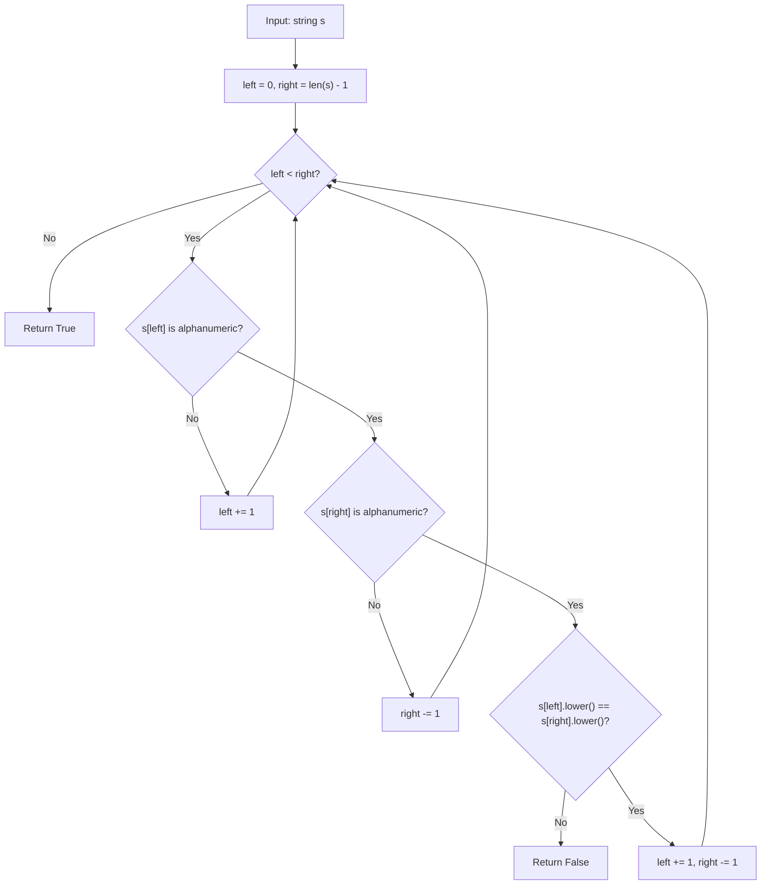

# Valid Palindrome (LeetCode 125)

Comprehensive study notes and 5 YOE senior engineering interview preparation guide on the **Two-Pointer Palindrome Check Pattern** for **Valid Palindrome** (LeetCode 125).

---

## 1. Core Concepts & Algorithmic Foundation

### 1.1 Problem Definition
Given a string `s`, determine if it is a palindrome after:
1. Converting all uppercase letters to lowercase.
2. Removing all non-alphanumeric characters.

A palindrome reads the same forward and backward.

- **Constraints**:
  - $1 \le |s| \le 2 \times 10^5$
  - `s` consists only of printable ASCII characters.
  - Optimal Time Target: $\mathcal{O}(N)$
  - Optimal Auxiliary Space Target: $\mathcal{O}(1)$

---

### 1.2 Algorithmic Mechanics

1. **Two-Pointer Convergence**:
   - Place `left` at index 0 and `right` at index `len(s) - 1`.
   - Advance `left` rightward and `right` leftward, skipping non-alphanumeric characters.
   - At each step, compare `s[left].lower()` with `s[right].lower()`.
   - If any pair mismatches, return `False`. If pointers cross without mismatch, return `True`.

2. **Character Filtering**:
   - Use `str.isalnum()` to check if a character is alphanumeric (letters or digits).
   - Use `str.lower()` for case-insensitive comparison.
   - Digits are considered alphanumeric: `"0P"` is NOT a palindrome because `'0' != 'p'`.

3. **Key Insight -- Why $\mathcal{O}(1)$ Space**:
   - The two-pointer approach avoids building a filtered copy of the string.
   - Each pointer traverses at most $N$ positions total, so total work is $\mathcal{O}(N)$.

---

## 2. Algorithm Approaches & Complexity Analysis

### 2.1 Complexity Matrix

| Approach | Time Complexity | Auxiliary Space | Remarks |
| :--- | :--- | :--- | :--- |
| **Two-Pointer In-Place** | $\mathcal{O}(N)$ | $\mathcal{O}(1)$ | Optimal; skips non-alnum in-place |
| **Filter + Reverse** | $\mathcal{O}(N)$ | $\mathcal{O}(N)$ | Build cleaned string, compare with reverse |
| **Filter + Two-Pointer** | $\mathcal{O}(N)$ | $\mathcal{O}(N)$ | Build cleaned string, then use two pointers |
| **Regex + Reverse** | $\mathcal{O}(N)$ | $\mathcal{O}(N)$ | `re.sub(r'[^a-zA-Z0-9]', '', s).lower()` then reverse |

---

### 2.2 Execution Flow Diagram (Two-Pointer In-Place)



---

## 3. Implementation Patterns (Python 3.14)

### 3.1 Two-Pointer In-Place (Optimal)

```python
class Solution:
    def isPalindrome(self, s: str) -> bool:
        left = 0
        right = len(s) - 1

        while left < right:
            while left < right and not s[left].isalnum():
                left += 1
            while left < right and not s[right].isalnum():
                right -= 1

            if s[left].lower() != s[right].lower():
                return False

            left += 1
            right -= 1

        return True
```

### 3.2 Filter + Reverse (Simpler, More Space)

```python
class Solution:
    def isPalindrome(self, s: str) -> bool:
        filtered = "".join(ch.lower() for ch in s if ch.isalnum())
        return filtered == filtered[::-1]
```

---

## 4. Edge Cases & Failure Modes

1. **Empty / Whitespace-Only (`" "`)**: After filtering, the string is empty. An empty string is trivially a palindrome. Output: `True`.
2. **Single Character (`"a"`)**: A single character is always a palindrome. Output: `True`.
3. **Only Non-Alphanumeric (`".,"`)**:  After filtering, the string is empty. Output: `True`.
4. **Mixed Case (`"Aa"`)**: After lowering, both characters are `'a'`. Output: `True`.
5. **Digit vs Letter (`"0P"`)**: `'0'` is alphanumeric but `'0' != 'p'`. Output: `False`.
6. **Classic Sentence (`"A man, a plan, a canal: Panama"`)**: After filtering: `"amanaplanacanalpanama"`. Output: `True`.
7. **Nearly Palindrome (`"race a car"`)**: `"raceacar"` -- `'r' == 'r'`, `'a' == 'a'`, `'c' == 'c'`, `'e' != 'a'`. Output: `False`.
8. **Maximum Length ($N = 2 \times 10^5$)**: Two-pointer approach processes in a single pass with constant space -- no performance concerns.

---

## 5. 5 YOE Senior Interview Questions & Answers

### Q1: Why is the two-pointer approach preferred over filter + reverse in an interview context?

**Answer**:
The two-pointer approach achieves $\mathcal{O}(1)$ auxiliary space by avoiding the construction of a filtered string. While both approaches run in $\mathcal{O}(N)$ time, the space difference matters:

1. **Memory Efficiency**: For a $200{,}000$-character string, filter + reverse allocates up to $200{,}000$ bytes for the cleaned copy plus another $200{,}000$ bytes for the reversed copy. Two-pointer uses only two integer variables.
2. **Cache Friendliness**: Two-pointer reads from the original string's memory layout -- no allocation, no garbage collection pressure.
3. **Demonstrates Mastery**: Interviewers look for the ability to eliminate unnecessary allocations. The filter approach is a valid $\mathcal{O}(N)$ solution, but showing the $\mathcal{O}(1)$ space optimization signals deeper understanding.

*Follow-up*: When might filter + reverse actually be preferred?
*Answer*: In production code where clarity matters more than micro-optimization -- the one-liner `"".join(...) == "".join(...)[::-1]` is more readable and less error-prone than managing pointer bounds manually. Python string slicing is also highly optimized in CPython.

---

### Q2: How would you handle Unicode strings (e.g., accented characters, CJK ideographs)?

**Answer**:
1. **`str.isalnum()` in Python 3**: Already handles Unicode -- it returns `True` for any Unicode letter or digit (e.g., accented `e` in French, Chinese characters, Arabic numerals).
2. **Case Folding vs Lowering**: `str.lower()` does not handle all Unicode case mappings correctly. Use `str.casefold()` for locale-independent case-insensitive comparison. Example: the German `ss` -- `"ss".casefold() == "ss"` while `"ss".lower() == "ss"` (same here, but `casefold` handles edge cases like the Turkish dotted-I).
3. **Normalization**: Unicode strings can have equivalent but distinct representations (e.g., `e + combining accent` vs `precomposed e`). Use `unicodedata.normalize('NFC', s)` before comparison to canonicalize.

*Follow-up*: Does the LeetCode problem require Unicode handling?
*Answer*: No -- the constraint says "printable ASCII characters". But knowing the Unicode considerations demonstrates production readiness.

---

### Q3: This problem checks if a string is a palindrome. How would you check if a string can be rearranged into a palindrome (without actually rearranging)?

**Answer**:
A string can be rearranged into a palindrome if and only if **at most one character** has an odd frequency count.

```python
from collections import Counter

def can_form_palindrome(s: str) -> bool:
    counts = Counter(ch.lower() for ch in s if ch.isalnum())
    odd_count = sum(1 for v in counts.values() if v % 2 != 0)
    return odd_count <= 1
```

**Reasoning**: In a palindrome, characters mirror around the center. For even-length palindromes, every character must appear an even number of times. For odd-length palindromes, exactly one character occupies the center and can have an odd count.

*Follow-up*: What is the time/space complexity?
*Answer*: $\mathcal{O}(N)$ time (single pass through the string), $\mathcal{O}(K)$ space where $K$ is the alphabet size (at most 36 for alphanumeric ASCII -- effectively $\mathcal{O}(1)$).

---

### Q4: How does Valid Palindrome relate to the "Valid Palindrome II" problem (LeetCode 680)?

**Answer**:
**Valid Palindrome II** asks: given a string, determine if it can become a palindrome by removing **at most one** character.

The approach extends the two-pointer technique:
1. Use the same converging two-pointer scan.
2. When a mismatch is found at `(left, right)`, try two options:
   - Skip `left`: check if `s[left+1..right]` is a palindrome.
   - Skip `right`: check if `s[left..right-1]` is a palindrome.
3. If either sub-check passes, return `True`.

This runs in $\mathcal{O}(N)$ time because the sub-check covers at most the remaining characters (no overlap with the already-validated prefix/suffix).

*Follow-up*: Can you generalize to "remove at most $k$ characters"?
*Answer*: Yes, but the time complexity grows to $\mathcal{O}(N \cdot 2^k)$ with naive branching, or $\mathcal{O}(N^2)$ using DP (longest palindromic subsequence). For $k = 1$, the greedy two-pointer approach is optimal.

---

### Q5: Walk through the dry-run of `"A man, a plan, a canal: Panama"` step by step.

**Answer**:

After filtering and lowering: `"amanaplanacanalpanama"` (length 21).

Using the two-pointer approach on the **original** string (no filtering step):

| Step | left | right | s[left] | s[right] | Action |
| :--- | :--- | :--- | :--- | :--- | :--- |
| 1 | 0 | 29 | `A` | `a` | `'a' == 'a'` -- match, advance both |
| 2 | 1 | 28 | ` ` | `m` | left is space, skip left |
| 3 | 2 | 28 | `m` | `m` | `'m' == 'm'` -- match, advance both |
| 4 | 3 | 27 | `a` | `a` | `'a' == 'a'` -- match, advance both |
| ... | ... | ... | ... | ... | Pointers continue converging, skipping `:`, `,`, spaces |
| Final | 14 | 15 | `a` | `a` | `'a' == 'a'` -- match, left >= right, done |

**Result**: All pairs matched. Return `True`.

---

## 6. Authoritative References & Further Reading

- [LeetCode 125 -- Valid Palindrome Problem Specification](https://leetcode.com/problems/valid-palindrome/)
- [LeetCode 680 -- Valid Palindrome II](https://leetcode.com/problems/valid-palindrome-ii/) (natural follow-up)
- [LeetCode 5 -- Longest Palindromic Substring](https://leetcode.com/problems/longest-palindromic-substring/) (related palindrome pattern)
- Cormen, T. H., Leiserson, C. E., Rivest, R. L., & Stein, C. (2022). *Introduction to Algorithms (4th ed.)* -- String matching fundamentals.
- [Python Documentation -- str.isalnum()](https://docs.python.org/3/library/stdtypes.html#str.isalnum)
