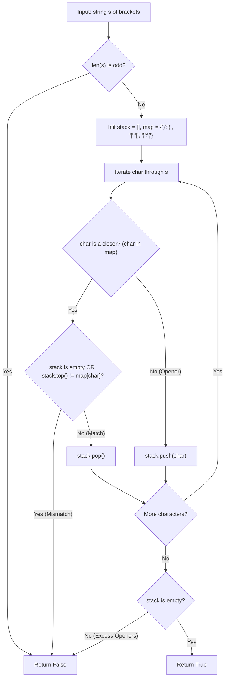

# Valid Parentheses (LeetCode 20)

Comprehensive study notes and 5 YOE senior engineering interview preparation guide on the **Stack-Based Bracket Matching Pattern** for **Valid Parentheses** (LeetCode 20).

---

## 1. Core Concepts & Algorithmic Foundation

### 1.1 Problem Definition
Given a string `s` containing only the characters `(`, `)`, `{`, `}`, `[`, and `]`, determine if the input string is valid.

A string is valid if:
1. Open brackets must be closed by the **same type** of brackets.
2. Open brackets must be closed in the **correct order**.
3. Every close bracket has a corresponding open bracket of the **same type**.

- **Constraints**:
  - $1 \le |s| \le 10^4$
  - `s` consists of parentheses only: `()[]{}`.
  - Optimal Time Target: $\mathcal{O}(N)$
  - Optimal Auxiliary Space Target: $\mathcal{O}(N)$ (worst case all openers)

---

### 1.2 Algorithmic Mechanics

1. **Stack Invariant (LIFO Matching)**:
   - A stack naturally models the nesting structure of brackets. The most recently opened bracket must be closed first -- this is exactly LIFO semantics.
   - Push every **opening** bracket onto the stack.
   - On every **closing** bracket, pop from the stack and verify that the popped opener matches the current closer.

2. **Mismatch Detection (Three Failure Modes)**:
   - **Type Mismatch**: Popped opener does not match the current closer (e.g., `([)]`).
   - **Excess Closers**: A closing bracket arrives but the stack is empty -- no opener to match against.
   - **Excess Openers**: After processing the entire string, the stack is non-empty -- unmatched openers remain.

3. **Pair Mapping**:
   - A hash map provides $\mathcal{O}(1)$ lookup for the opener-closer relationship:
     ```
     ')' -> '('
     ']' -> '['
     '}' -> '{'
     ```
   - Mapping from closer-to-opener (rather than opener-to-closer) enables direct comparison against the stack top during the closing-bracket branch.

4. **Early Termination Optimization**:
   - If `len(s)` is odd, the string can never be valid -- return `False` immediately.
   - If the stack grows beyond $N/2$, there are not enough characters remaining to close all openers.

---

## 2. Algorithm Approaches & Complexity Analysis

### 2.1 Complexity Matrix

| Approach | Time Complexity | Auxiliary Space | Remarks |
| :--- | :--- | :--- | :--- |
| **Stack + Hash Map** | $\mathcal{O}(N)$ | $\mathcal{O}(N)$ | Single pass; industry standard; optimal |
| **Stack + Complement Push** | $\mathcal{O}(N)$ | $\mathcal{O}(N)$ | Pushes expected closer instead of opener; cleaner comparison |
| **Counter-based (single bracket type only)** | $\mathcal{O}(N)$ | $\mathcal{O}(1)$ | Only works for `()` -- fails for mixed bracket types |
| **String Replacement** | $\mathcal{O}(N^2)$ | $\mathcal{O}(N)$ | Repeatedly replace `()`, `[]`, `{}` with empty string; correct but slow |

---

### 2.2 Execution Flow Diagram (Stack + Hash Map)



---

## 3. Implementation Patterns (Python 3.14)

### 3.1 Standard Stack + Hash Map (Production Grade)

```python
class Solution:
    def isValid(self, s: str) -> bool:
        if len(s) % 2 != 0:
            return False

        closer_to_opener: dict[str, str] = {
            ")": "(",
            "]": "[",
            "}": "{",
        }
        stack: list[str] = []

        for char in s:
            if char in closer_to_opener:
                if not stack or stack[-1] != closer_to_opener[char]:
                    return False
                stack.pop()
            else:
                stack.append(char)

        return not stack
```

### 3.2 Complement Push Variant (Cleaner Comparison)

Instead of mapping closer-to-opener on comparison, push the **expected closer** when an opener is encountered. On a closing bracket, compare directly against `stack.top()`.

```python
class Solution:
    def isValid(self, s: str) -> bool:
        if len(s) % 2 != 0:
            return False

        stack: list[str] = []

        for char in s:
            if char == "(":
                stack.append(")")
            elif char == "[":
                stack.append("]")
            elif char == "{":
                stack.append("}")
            elif not stack or stack.pop() != char:
                return False

        return not stack
```

---

## 4. Edge Cases & Failure Modes

1. **Empty-like (Odd Length `"("`)**: Odd-length strings fail immediately via the early termination check. Output: `False`.
2. **Single Pair (`"()"`)**:  Minimal valid input. Push `(`, pop on `)`, stack empty. Output: `True`.
3. **Nested Valid (`"([{}])"`)**: Full nesting depth exercised. Each closer matches its corresponding opener in LIFO order. Output: `True`.
4. **Interleaved Invalid (`"([)]"`)**: `[` is on top when `)` arrives -- type mismatch. Output: `False`.
5. **Only Openers (`"((("`)**: Stack non-empty after full traversal -- excess openers. Output: `False`.
6. **Only Closers (`")))"`)**: Stack empty when first closer arrives -- excess closers. Output: `False`.
7. **Repeated Valid Pairs (`"(){}[]"`)**: Sequential (non-nested) valid pairs. Each pair resolves independently. Output: `True`.
8. **Maximum Length String ($N = 10^4$)**: Stack grows to at most $N/2$ elements ($5000$ single-char entries) -- well within memory limits.

---

## 5. 5 YOE Senior Interview Questions & Answers

### Q1: Why is a stack the correct data structure for bracket matching, and why won't a queue or a simple counter work?

**Answer**:
Bracket matching exhibits **LIFO nesting semantics**: the most recently opened bracket must be the first one closed. A stack enforces this invariant naturally -- `push` records an opener, `pop` resolves it with the nearest closer.

A **queue** (FIFO) would attempt to match the *oldest* opener with the *newest* closer, which violates nesting rules. For example, `([])` would incorrectly try to match `(` with `]`.

A **simple counter** (increment on open, decrement on close) only tracks *quantity*, not *type* or *order*. It correctly validates `()()` but incorrectly validates `)(` (counter reaches 0) and `([)]` (counter reaches 0 but nesting is invalid). Counters work only for single bracket-type problems.

*Follow-up*: Could you use a deque instead of a stack?
*Answer*: Yes -- a deque used exclusively from one end (`append`/`pop` on the right) is functionally identical to a stack. Python's `collections.deque` provides $\mathcal{O}(1)$ append/pop on both ends, but for this problem a plain `list` is simpler and equally performant since we only use one end.

---

### Q2: How would you extend this solution to handle additional bracket types or custom delimiters (e.g., `<>`, `/* */`, HTML tags)?

**Answer**:
1. **Single-character delimiters** (e.g., `<>`): Add the pair to the `closer_to_opener` map. No algorithmic change required -- the stack logic is delimiter-agnostic.
2. **Multi-character delimiters** (e.g., `/* */`): Replace character-level iteration with a tokenizer/lexer that emits delimiter tokens. The stack stores tokens instead of characters. Matching logic remains identical but operates on token equality rather than character equality.
3. **HTML/XML tags** (e.g., `<div>...</div>`): Parse tag names from `<tag>` and `</tag>`. Push tag names on open tags, pop and compare on close tags. Self-closing tags (`<br/>`) are neither pushed nor popped. This is essentially how DOM parsers validate well-formedness.

*Follow-up*: What about nested comments like `(* (* *) *)`?
*Answer*: Standard regex-based lexers cannot handle nested comments because regular languages cannot count unbounded nesting. Use a stack-based tokenizer (or a recursive descent parser with a nesting counter for the single comment-delimiter case).

---

### Q3: In a production system, how would you validate bracket matching in a real-time collaborative code editor (e.g., VS Code Live Share)?

**Answer**:
1. **Incremental Validation**: Re-scanning the entire document on every keystroke is $\mathcal{O}(N)$ per edit. Instead, use a **balanced binary tree** (e.g., a Piece Table or Rope backed by a segment tree) where each node stores the count of unmatched openers and closers for its subtree. An edit at position $i$ triggers $\mathcal{O}(\log N)$ updates up the tree.
2. **Conflict-Free Replicated Data Type (CRDT)**: For multi-cursor collaborative editing, bracket state must be mergeable without coordination. Each character carries a logical timestamp; bracket validation is recomputed from the CRDT's linearized sequence.
3. **Scope-Based Caching**: Editors like VS Code use a **TextMate grammar tokenizer** that caches token scopes per line. Bracket matching queries use the cached scope boundaries rather than re-parsing from scratch.

---

### Q4: What is the relationship between Valid Parentheses and the Catalan Number sequence?

**Answer**:
The **$n$-th Catalan Number** $C_n = \frac{1}{n+1}\binom{2n}{n}$ counts the number of valid parenthesizations of $n$ pairs of a single bracket type. For example, $C_3 = 5$ corresponds to the five valid strings of length 6: `((()))`, `(()())`, `(())()`, `()(())`, `()()()`.

This connection arises because valid parenthesizations are in bijection with:
- **Dyck paths**: Lattice paths from $(0,0)$ to $(2n,0)$ using steps $+1$ (open) and $-1$ (close) that never go below the $x$-axis.
- **Full binary trees** with $n$ internal nodes.
- **Triangulations** of a convex $(n+2)$-gon.

For mixed bracket types (e.g., `()[]{}`), the count generalizes: with $k$ bracket types and $n$ total pairs, the number of valid strings is the **Fuss-Catalan number** or can be derived from the **super Catalan numbers**, depending on whether bracket types are interchangeable.

*Follow-up*: Why does this matter practically?
*Answer*: In compiler design and combinatorial testing, the Catalan number gives the size of the test space for exhaustive bracket-matching validation. For $n = 15$ pairs, $C_{15} = 9{,}694{,}845$ -- tractable for exhaustive testing. For $n = 20$, $C_{20} = 6{,}564{,}120{,}420$ -- requiring sampling strategies.

---

### Q5: Walk through the dry-run of `"{[()]}"` step by step.

**Answer**:

| Step | Character | Action | Stack State (top right) | Reason |
| :--- | :--- | :--- | :--- | :--- |
| 1 | `{` | Push | `{` | Opener |
| 2 | `[` | Push | `{ [` | Opener |
| 3 | `(` | Push | `{ [ (` | Opener |
| 4 | `)` | Pop `(` | `{ [` | `)` matches `(` |
| 5 | `]` | Pop `[` | `{` | `]` matches `[` |
| 6 | `}` | Pop `{` | *(empty)* | `}` matches `{` |

**Result**: Stack is empty after processing all characters. Return `True`.

If step 4 had been `]` instead of `)`, the stack top would be `(` which does not match `]` -- immediate `False` return (interleaved invalid case).

---

## 6. Authoritative References & Further Reading

- [LeetCode 20 -- Valid Parentheses Problem Specification](https://leetcode.com/problems/valid-parentheses/)
- Cormen, T. H., Leiserson, C. E., Rivest, R. L., & Stein, C. (2022). *Introduction to Algorithms (4th ed.)* -- Chapter 10: Elementary Data Structures (Stacks and Queues).
- Stanley, R. P. (2015). *Catalan Numbers* -- Cambridge University Press. Comprehensive treatment of the combinatorial connections to valid parenthesizations.
- [CP-Algorithms -- Bracket Sequences](https://cp-algorithms.com/combinatorics/bracket_sequences.html)
