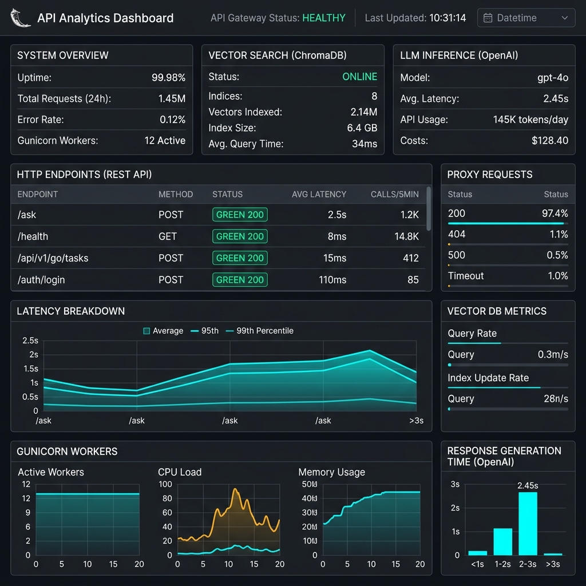

# 🐍 Production-Grade Flask RAG API & Microservice Gateway

[](https://flask-rag-api-191y.onrender.com)
[](https://python.org)
[](https://flask.palletsprojects.com/)
[](https://github.com/astral-sh/uv)
[](https://www.trychroma.com/)

An enterprise-ready, modular **Retrieval-Augmented Generation (RAG) REST API & BFF Gateway** built with Flask, Gunicorn WSGI, ChromaDB vector store, OpenAI API, and Astral `uv`. Acts as the central gateway connecting the React SPA frontend to downstream Go microservices.

---

## 🌐 Live Microservice Links

| Microservice | Role | Tech Stack | Live URL | Hosting Platform |
| :--- | :--- | :--- | :--- | :--- |
| **Flask RAG API** | BFF Gateway & RAG Engine | Python 3.14 + Flask + Gunicorn | [https://flask-rag-api-191y.onrender.com](https://flask-rag-api-191y.onrender.com) | Render PaaS |
| **React SPA** | Telemetry UI & Dashboard | React 19 + Vite + Tailwind | [https://react-fundamentals-eight.vercel.app](https://react-fundamentals-eight.vercel.app) | Vercel Edge |
| **Go Engine** | Low-Latency Microservice | Go 1.25 Stdlib + Docker | [https://render-go-service-txtm.onrender.com](https://render-go-service-txtm.onrender.com) | Render PaaS |

---

## 📸 API Gateway Analytics Screenshot



---

## 🏛️ Enterprise Architecture Highlights

- **Application Factory Pattern (`create_app()`)**: Dynamically configures the application across Development, Testing, and Production environments without global side-effects.
- **Flask Blueprints (`src/flask_rag_api/api/`)**: Domain-driven routing separation (`health_bp`, `rag_bp`, `go_proxy_bp`).
- **Go Microservice Proxy Gateway (`go_proxy.py`)**: Inter-service proxy relaying `/api/v1/go/*` requests to the Go microservice using connection-pooled HTTP clients (`httpx`).
- **ChromaDB Hybrid Fallback**: In-memory vector database fallback ensuring robust execution even when persistent disk storage is unavailable.
- **Structured Production Logging (`logging.py`)**: JSON/standardized log format for observability.
- **Global Exception Handler (`errors.py`)**: Unified JSON error schema across HTTP 4xx/5xx exceptions.
- **Multi-Stage Containerization (`Dockerfile`)**: Lightweight Python 3.14 production Docker image.

---

## 📁 Directory Structure

```text
ai-engineering/production/flask-rag-api/
├── Dockerfile                   # Multi-stage production Docker container build
├── .dockerignore                # Container context build exclusions
├── .env.example                 # Environment variable template
├── Procfile                     # Gunicorn startup file (`web: gunicorn wsgi:app`)
├── pyproject.toml               # PEP 621 package dependencies & metadata (uv managed)
├── README.md                    # Production architecture documentation
├── render.yaml                  # Render Infrastructure Blueprint
├── wsgi.py                      # Production WSGI entrypoint
├── assets/                      # Application screenshots & visual assets
│   └── flask_rag_api_dashboard.png
├── src/
│   └── flask_rag_api/
│       ├── __init__.py          # Application Factory (`create_app()`)
│       ├── config.py            # Strongly-typed environment configuration
│       ├── api/                 # Flask Blueprints
│       │   ├── health.py        # Health & readiness endpoint (/health)
│       │   ├── rag.py           # RAG REST API endpoints (/ask, /index)
│       │   └── go_proxy.py      # Downstream Go microservice proxy (/api/v1/go/*)
│       ├── core/                # RAG Engine core logic
│       │   └── pipeline.py      # Vector search & OpenAI generation engine
│       └── utils/               # Production utilities
│           ├── errors.py        # Global exception handling
│           └── logging.py       # Structured logging setup
└── tests/
    ├── conftest.py              # Pytest client fixtures
    ├── integration/
    │   └── test_api_routes.py   # Blueprint integration tests
    └── unit/
        └── test_pipeline.py     # Core pipeline unit tests
```

---

## 🚀 Quick Start (Local Development)

```bash
# 1. Navigate to directory
cd ai-engineering/.production/flask-rag-api

# 2. Copy environment template
cp .env.example .env

# 3. Run production WSGI server with uv
uv run wsgi.py
```

### Running Automated Tests

```bash
# Run unit and integration tests with pytest
uv run pytest
```

---

## ☁️ Cloud Deployment (Render PaaS)

1. Connect repository on [Render](https://render.com).
2. Set **Root Directory** to `ai-engineering/.production/flask-rag-api`.
3. Set **Build Command** to `pip install uv && uv pip install --system .`.
4. Set **Start Command** to `gunicorn --bind 0.0.0.0:$PORT wsgi:app`.
5. Configure Environment Variables: `OPENAI_API_KEY`, `GO_SERVICE_URL=https://render-go-service-txtm.onrender.com`.

---

## 💡 5 YOE Senior Engineer Interview Talking Points

1. **Why Application Factory over Global `app = Flask(__name__)`?**
   - *Answer*: Avoids global state mutations, enables distinct configuration contexts for unit testing with pytest fixtures, and prevents circular import dependencies across blueprints.

2. **WSGI Server Production Scaling (Gunicorn)**:
   - *Answer*: Flask's built-in WSGI server is single-threaded and unsuited for production. Gunicorn forks multiple worker processes (`2 * CPU + 1`), handling concurrent HTTP requests cleanly across worker cores.

3. **ChromaDB Ephemeral Disk & Vector Resilience**:
   - *Answer*: PaaS containers like Render use ephemeral filesystems. The service implements in-memory fallback initialization so document querying gracefully falls back without server crashes if local storage is reset.

4. **Inter-Service Proxying (`httpx` Client Pooling)**:
   - *Answer*: Server-to-server proxy calls to the Go microservice reuse an `httpx.AsyncClient` session pool, eliminating TCP connection handshake overhead for high-concurrency requests.
