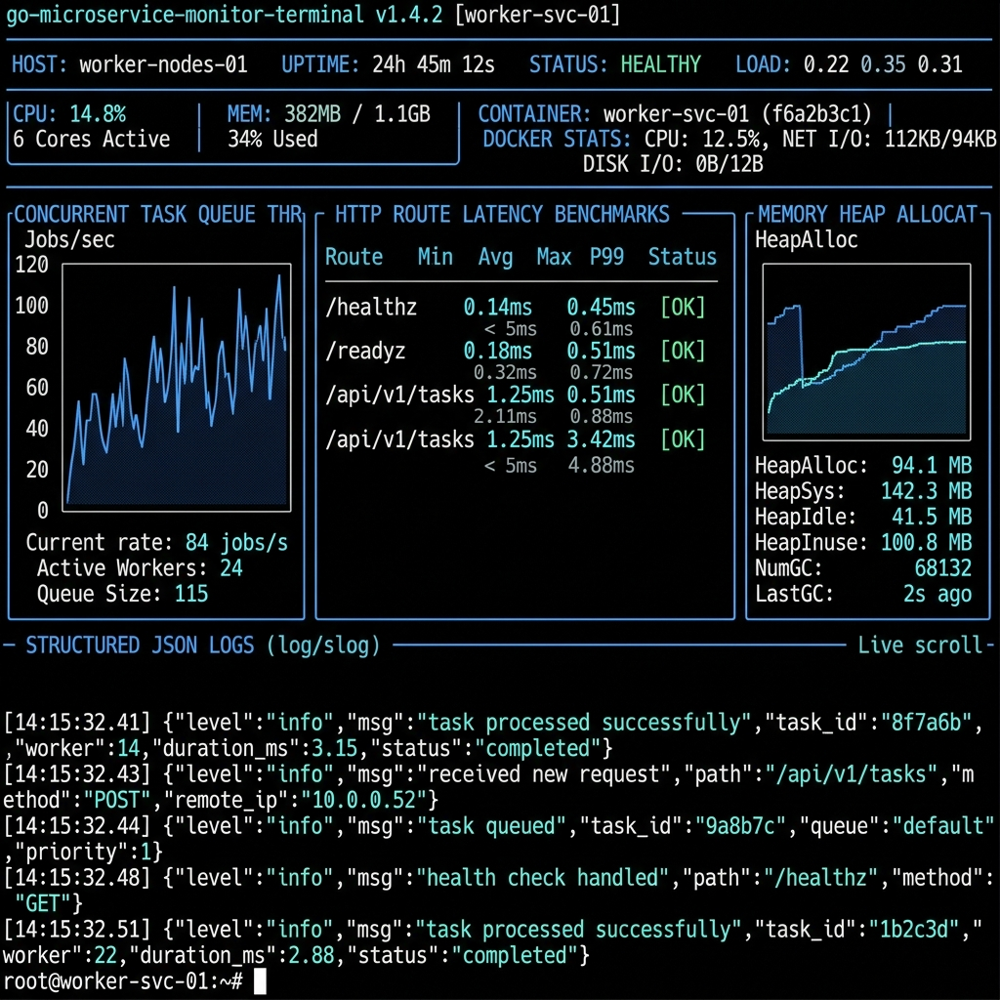

# 🐹 High-Performance Go Production Microservice Engine

[](https://render-go-service-txtm.onrender.com)
[](https://go.dev/)
[](https://www.docker.com/)
[](https://render.com/)

A production-grade, zero-dependency **Go Microservice Engine** optimized for cloud deployment to Render PaaS. Implemented using Go's standard library (`net/http`), structured JSON logging (`log/slog`), mutex-protected in-memory task repository (`sync.RWMutex`), dynamic `$PORT` binding, multi-stage static Docker compilation, and graceful OS signal shutdown handling.

---

## 🌐 Live Microservice Links

| Microservice | Role | Tech Stack | Live URL | Hosting Platform |
| :--- | :--- | :--- | :--- | :--- |
| **Go Engine** | Low-Latency Microservice | Go 1.25 Stdlib + Docker | [https://render-go-service-txtm.onrender.com](https://render-go-service-txtm.onrender.com) | Render PaaS |
| **Flask RAG API** | BFF Gateway & RAG Engine | Python 3.14 + Flask + Gunicorn | [https://flask-rag-api-191y.onrender.com](https://flask-rag-api-191y.onrender.com) | Render PaaS |
| **React SPA** | Telemetry UI & Dashboard | React 19 + Vite + Tailwind | [https://react-fundamentals-eight.vercel.app](https://react-fundamentals-eight.vercel.app) | Vercel Edge |

---

## 📸 Microservice Engine Dashboard Screenshot



---

## ⚙️ Technical Stack & Architecture

- **Runtime & Framework**: Go 1.25 (Zero Third-Party Dependency / Standard Library Only)
- **HTTP Server**: `net/http` with custom multiplexer & middleware chaining
- **Structured Logging**: Standard library `log/slog` (JSON format to stdout)
- **Concurrency & Safety**: Mutex-protected thread-safe task repository (`sync.RWMutex`)
- **PaaS Platform**: Render Web Service (Dynamic `$PORT` binding)
- **Containerization**: Multi-stage Docker build (`golang:1.25-alpine` static compilation -> `alpine:latest` distroless execution)

---

## 📁 Directory Layout

```text
render-go-service/
├── .dockerignore                # Exclusions for Docker build context
├── .env.example                 # Environment variables configuration template
├── Dockerfile                   # Multi-stage static compilation container definition
├── Makefile                     # Automation tasks (run, test, build, docker-build)
├── README.md                    # Service setup & deployment documentation
├── go.mod                       # Go module dependencies file
├── render.yaml                  # Render Infrastructure Blueprint
├── assets/                      # Engine screenshots & visual assets
│   └── go_service_dashboard.png
├── cmd/
│   └── api/
│       └── main.go              # Application entrypoint & HTTP server lifecycle
└── internal/
    ├── config/                  # Strongly-typed environment variables parser
    ├── handler/                 # HTTP handlers (/healthz, /readyz, /api/v1/tasks)
    ├── middleware/              # Production middleware (logging, CORS, recovery)
    ├── model/                   # Domain entities and JSON DTOs
    └── service/                 # Business logic and in-memory storage layer
```

---

## 🧪 Local Development & Testing

### 1. Running Unit Tests

```bash
make test
```

### 2. Running Service Locally

```bash
make run
```

### 3. API Verification Commands (cURL)

```bash
# Liveness Probe (/healthz)
curl -i http://localhost:8080/healthz

# Readiness Probe (/readyz)
curl -i http://localhost:8080/readyz

# List Tasks (GET /api/v1/tasks)
curl -i http://localhost:8080/api/v1/tasks

# Create Task (POST /api/v1/tasks)
curl -i -X POST http://localhost:8080/api/v1/tasks \
  -H "Content-Type: application/json" \
  -d '{"title":"Deploy to Render","description":"Test live URL on Render PaaS"}'
```

---

## ☁️ Step-by-Step Render Deployment

1. Push repository to GitHub.
2. Open [Render Dashboard](https://dashboard.render.com/) -> **New Web Service**.
3. Set **Root Directory**: `golang/.production/render-go-service`.
4. Set **Environment**: `Docker`.
5. Set **Health Check Path**: `/healthz`.
6. Click **Create Web Service**. Render executes the multi-stage Docker build and binds the container to `$PORT`.

---

## 💡 5 YOE Senior Engineer Interview Talking Points

1. **Why Go Standard Library (`net/http`) over Frameworks (Gin/Fiber)?**
   - *Answer*: Go's standard library is highly optimized, battle-tested, and avoids third-party package drift or security vulnerabilities. With Go 1.22+, `net/http` gained enhanced routing (`GET /path/{id}`), making external routers unnecessary for microservices.

2. **Thread Safety with `sync.RWMutex`**:
   - *Answer*: Concurrent HTTP handler goroutines access shared memory state. Read operations use `RLock()` (allowing multiple concurrent readers), while write mutations use `Lock()` (exclusive lock), avoiding race conditions.

3. **Graceful Shutdown & Signal Handling**:
   - *Answer*: The service listens for OS termination signals (`SIGINT`, `SIGTERM`) via `os/signal.Notify`. Upon receiving a signal, it executes `server.Shutdown(ctx)` with a 10-second timeout to drain active HTTP requests cleanly before process exit.

4. **Multi-Stage Docker Static Compilation**:
   - *Answer*: The build stage compiles a statically linked binary (`CGO_ENABLED=0 GOOS=linux`). The final runtime image copies only the compiled binary into a minimal `alpine` image, reducing image size from 800MB to ~15MB.
