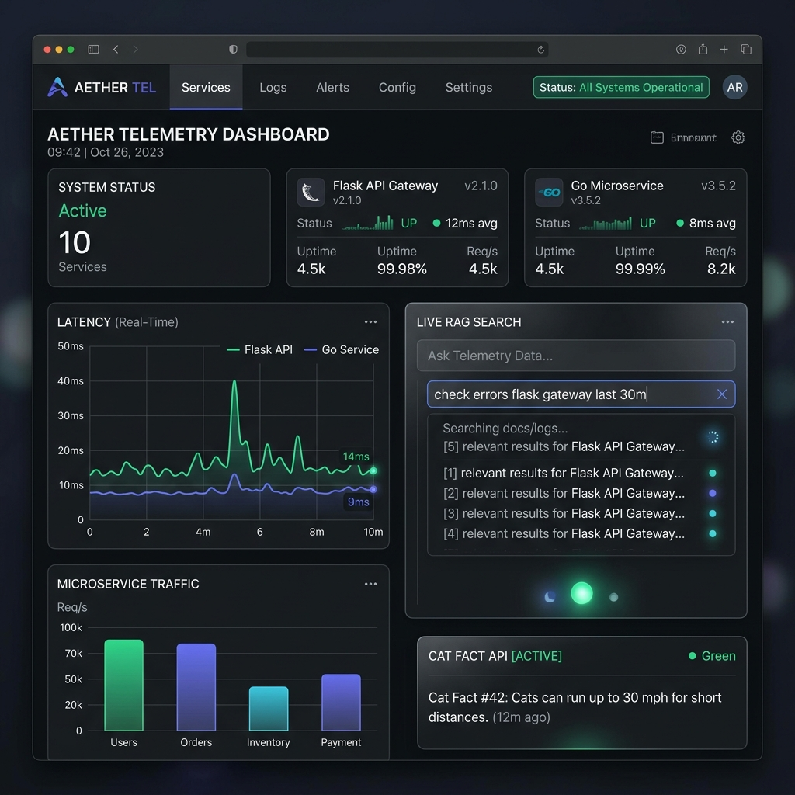

# ⚡ React 19 + Vite Microservice Telemetry Dashboard & AI Portfolio

[](https://react-fundamentals-eight.vercel.app)
[](https://react.dev/)
[](https://vitejs.dev/)
[](https://tailwindcss.com/)

A modern, production-grade **React SPA** serving as the frontend telemetry dashboard and user portal for a 3-tier distributed microservices ecosystem (**React SPA → Flask BFF Gateway → Go High-Performance Microservice**).

---

## 🌐 Live Microservice Links

| Service Tier | Component / Scope | Technology | Live URL | Deployment Platform |
| :--- | :--- | :--- | :--- | :--- |
| **Frontend Tier** | Telemetry Dashboard & SPA UI | React 19 + Vite + Tailwind | [https://react-fundamentals-eight.vercel.app](https://react-fundamentals-eight.vercel.app) | Vercel Edge Network |
| **BFF Gateway Tier** | Flask RAG REST API & Proxy | Python 3.14 + Flask + ChromaDB | [https://flask-rag-api-191y.onrender.com](https://flask-rag-api-191y.onrender.com) | Render PaaS |
| **Computation Tier** | Go High-Performance Engine | Go 1.25 Stdlib + Docker | [https://render-go-service-txtm.onrender.com](https://render-go-service-txtm.onrender.com) | Render PaaS |

---

## 📸 Application Screenshot



---

## 🏗️ 3-Tier Microservices Architecture

```text
+-----------------------------------------------------------------------------------+
| FRONTEND TIER (Vercel Edge Network)                                               |
| React SPA Telemetry Dashboard                                                     |
| - Real-time service status monitoring & latency tracking                          |
| - AI Assistant (RAG knowledge search interface)                                   |
| - Inter-service API invocation cards (Cat Facts, Task Manager)                     |
+-----------------------------------------------------------------------------------+
                                         |
                                         | HTTPS (JSON, CORS Managed / Edge Rewrites)
                                         v
+-----------------------------------------------------------------------------------+
| BACKEND-FOR-FRONTEND (BFF) GATEWAY TIER (Render PaaS)                             |
| Flask RAG REST API                                                                |
| - Endpoints: /ask, /health, /api/v1/go/tasks                                       |
| - Proxies computation requests to downstream Go service                           |
+-----------------------------------------------------------------------------------+
                                         |
                                         | Internal HTTP (Server-to-Server)
                                         v
+-----------------------------------------------------------------------------------+
| COMPUTATION TIER (Render PaaS)                                                    |
| Go Microservice Engine                                                            |
| - Low-latency REST endpoints (/healthz, /readyz, /api/v1/tasks)                   |
| - In-memory thread-safe task processing                                           |
+-----------------------------------------------------------------------------------+
```

---

## 🚀 Key Features & Components

- **📊 Microservice Telemetry Dashboard (`MicroserviceDashboard.jsx`)**: Real-time status cards, health readiness probes, latency badges, and live test buttons for both Flask Gateway and Go Microservice.
- **🤖 RAG AI Assistant (`AiAssistant.jsx`)**: Embedded AI search widget connecting to the Flask RAG backend for document querying with animated loading states and error handling.
- **🐱 Cat Facts Generator (`CatFact.jsx`)**: Asynchronous REST client component demonstrating API state handling (`idle`, `loading`, `success`, `error`).
- **📁 Projects Showcase (`Projects.jsx`)**: Filterable project gallery with live interaction state.
- **🧭 Responsive Navigation (`Navbar.jsx`)**: Mobile-first responsive navigation bar built with Tailwind CSS, ARIA accessibility attributes, and active tab highlights.

---

## 🛠️ Local Development Quickstart

```bash
# 1. Navigate to directory
cd react/react-fundamentals

# 2. Install dependencies
npm install

# 3. Start local development server
npm run dev

# 4. Build production bundle
npm run build
```

---

## 💡 5 YOE Senior Engineer Interview Talking Points

1. **Backend-For-Frontend (BFF) Pattern**:
   - *Question*: Why query the Flask API Gateway instead of contacting the Go microservice directly from React?
   - *Answer*: Encapsulating downstream services behind a BFF gateway prevents exposing internal microservice infrastructure to public client engines, consolidates CORS configuration to a single ingress, and allows server-side response aggregation.

2. **CORS Boundary Management**:
   - *Question*: How does the React app handle Cross-Origin Resource Sharing when deployed on Vercel?
   - *Answer*: `vercel.json` defines edge proxy rewrite rules (`/api/v1/go/:path*` → `https://render-go-service-txtm.onrender.com`), enabling same-origin requests during production and avoiding browser preflight delays.

3. **State Management & Async Resiliency**:
   - *Question*: How are network failures and latency spikes handled in the UI?
   - *Answer*: Components implement explicit state machines (`idle` | `loading` | `success` | `error`) with graceful retry mechanisms and non-blocking state updates.
